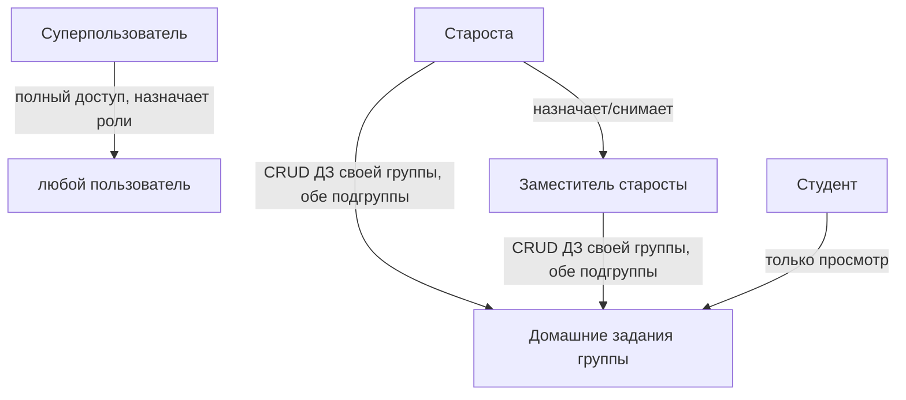
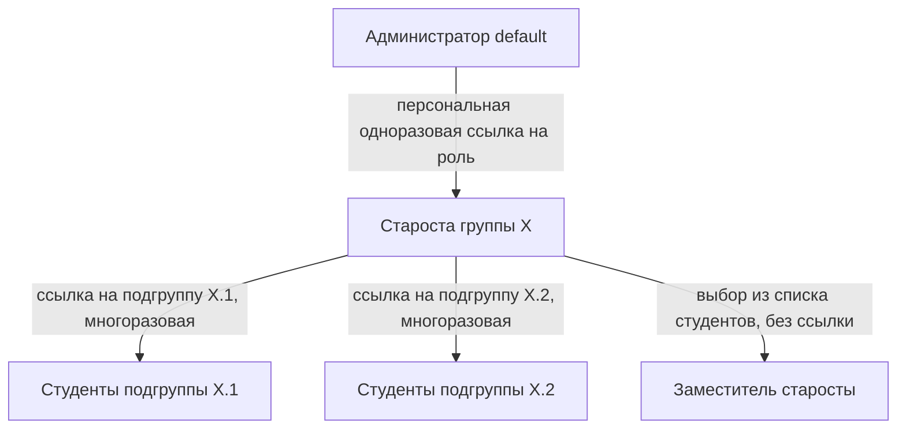
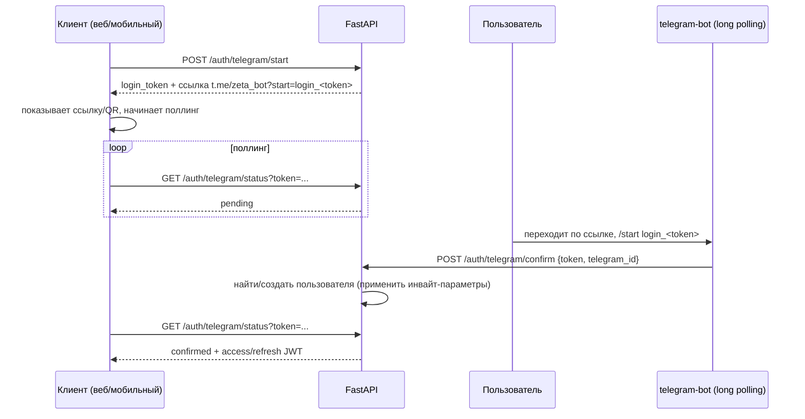
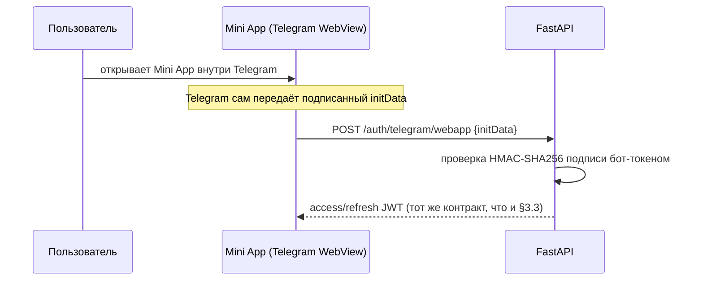
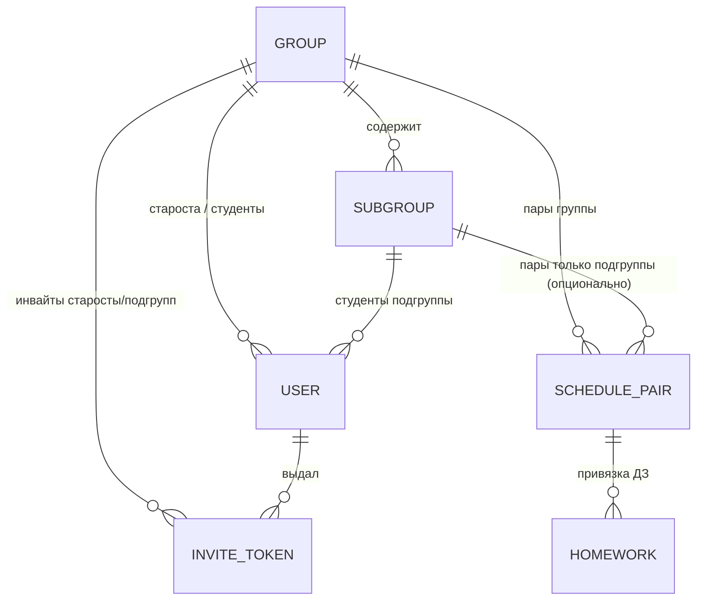
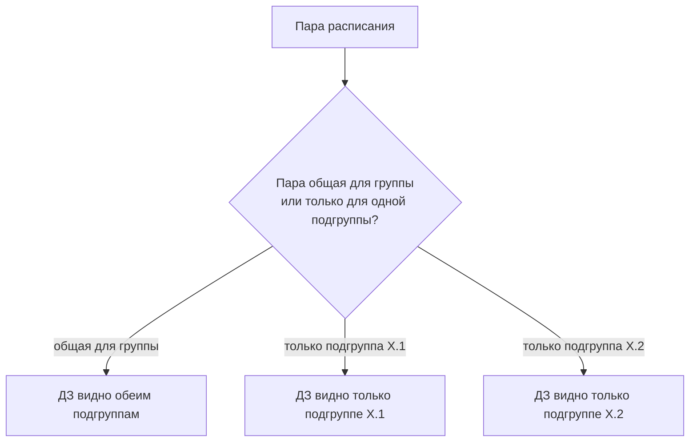
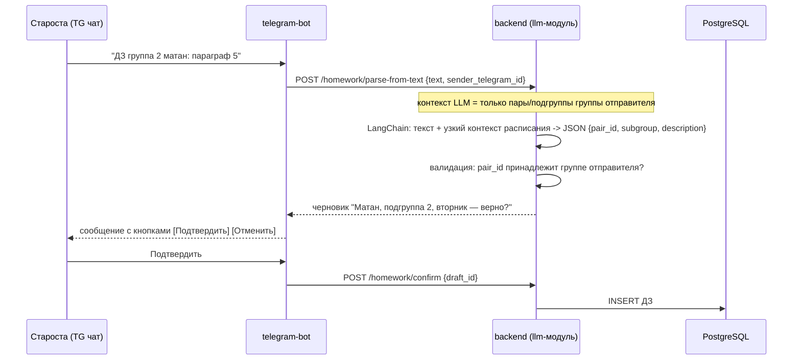
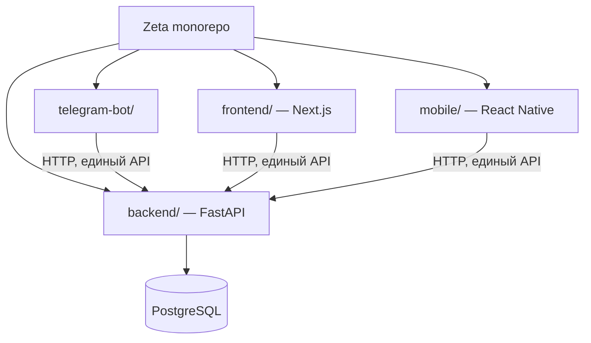

# Техническое задание
## Система учёта домашних заданий студентов ФКН

**Версия:** 0.5
**Дата:** …
**Автор:** …
**Статус:** черновик, на согласовании

---

## 1. Общее описание

Система представляет собой набор клиентов — веб-приложение, мобильное приложение на React Native и Telegram-бот — работающих поверх общего бэкенда и одной базы данных PostgreSQL. Назначение системы — централизованный сбор, хранение и просмотр домашних заданий (ДЗ) студентов факультета компьютерных наук. Источником данных о расписании служит Excel-таблица, публикуемая на Яндекс.Диске. Система привязывает ДЗ к конкретным парам расписания, что позволяет студенту видеть, что задано на ближайшие занятия, а старосте — быстро вносить задания вручную или через бота.

Целевая аудитория — студенты ФКН любого курса, направления, группы и подгруппы. Система не предназначена для преподавателей и не выполняет функции электронного журнала: она не хранит оценки, не отслеживает посещаемость и не является официальным источником учебной информации.

## 2. Пользователи и роли

В системе предусмотрены четыре роли:
- **Суперпользователь** (он же «Администратор» в §3 — это одна и та же роль, далее по тексту используются оба названия как синонимы) — полный доступ к системе: может назначать и снимать любую роль (старосты, заместителя, студента) у любого пользователя напрямую, не только через выдачу инвайт-ссылки на роль старосты. В частности, именно суперпользователь производит смену или снятие старосты группы (см. §3.2).
- **Староста** — авторизованный пользователь с расширенными правами. Создаёт и редактирует ДЗ своей группы, в том числе для всех её подгрупп, но не имеет доступа к редактированию ДЗ других групп. Видит список студентов своей группы и назначает из них заместителей.
- **Заместитель старосты** — отдельная роль, назначается самим старостой (не администратором) из числа уже зарегистрированных студентов его группы. Права внутри группы идентичны правам старосты (создание/редактирование ДЗ обеих подгрупп); отличие только в том, кто и как эту роль выдаёт и снимает.
- **Студент** — авторизованный пользователь. Помимо просмотра может менять свои параметры (Пока не придумал что, но Имя Фамилия точно).

Роль назначается через цепочку приглашений «сверху вниз»: администратор выдаёт роль старосты, староста — доступ студентам своей группы и роль заместителя внутри неё. Подробности — в §3.

## 3. Онбординг и авторизация

### 3.1 Модель доступа

Свободного гостевого доступа больше нет: система полностью закрыта, вход возможен только по приглашению. Это решение отменяет прежний пункт про просмотр ДЗ без авторизации — теперь любое действие, включая чтение, требует авторизованного аккаунта.

Идентичность пользователя строится вокруг `telegram_id` — это первичный ключ аккаунта. Отдельной пары email/пароль в системе нет: аккаунт в вебе, боте и (в перспективе) мобильном приложении — всегда один и тот же, потому что везде это один и тот же `telegram_id`. Задача связывания «веб-аккаунта» и «телеграм-аккаунта» не возникает по построению.

### 3.2 Роли и выдача доступа

Иерархия выдачи доступа:

1. **Администратор** — единственный аккаунт `default`, заводится вручную (сидом/миграцией) на конкретный `telegram_id`. Через админ-панель администратор создаёт персональную одноразовую пригласительную ссылку на роль старосты для конкретной группы.
2. **Староста** — получает роль, перейдя по ссылке от администратора (стандартный логин-флоу, см. §3.3). После этого в своём интерфейсе староста генерирует **две** пригласительные ссылки — по одной на каждую подгруппу своей группы. Эти ссылки многоразовые и бессрочные: их публикуют в чате подгруппы, и любой участник может по ним войти.
3. **Студент** — получает роль автоматически, перейдя по ссылке от старосты. Группа, курс, направление и подгруппа проставляются из самого токена ссылки — anketa не нужна, ручного выбора подгруппы после входа не требуется.
4. **Заместитель старосты** — назначается не по ссылке, а напрямую старостой: у старосты в интерфейсе есть список студентов его группы (обеих подгрупп), из которого он выбирает, кому выдать роль заместителя, и может её снять в любой момент.

**Смена и снятие старосты.** Производится суперпользователем напрямую через админ-панель (без отдельной инвайт-ссылки): суперпользователь может снять роль старосты с текущего пользователя и/или назначить нового старосту группы из уже зарегистрированных студентов этой группы, либо — если в группе ещё никого нет — выпустить новую персональную инвайт-ссылку, как при первичном назначении (см. п.1 выше). Что происходит с ранее назначенным этим старостой заместителем при смене старосты (сохраняется автоматически или сбрасывается) — открытый вопрос, см. §13.

**Бутстрап группы для инвайта старосты (решение).** Проблема: инвайт-ссылка на роль старосты выдаётся «для конкретной группы» (п.1), но группы создаются в БД только синхронизацией из Excel-расписания (§4.1) — то есть до первого парсинга группы физически не существует и пригласить старосту вроде бы не на что. Решение: инвайт-токен на роль старосты хранит не FK на существующую запись `groups`, а человекочитаемое имя группы (строку, как оно должно появиться в расписании). При активации ссылки бэкенд делает `get_or_create` по этому имени — если группа уже есть (создана парсингом), пользователь привязывается к ней; если ещё нет, создаётся новая запись группы, которая затем при следующем парсинге расписания сматчится с ней по имени (та же логика, что и синхронизация справочника в §4.1). Это снимает жёсткую зависимость «сначала расписание, потом инвайты» и позволяет суперпользователю выдавать ссылки старостам заранее, до первого запуска парсера.

Все действия, связанные с записью (создание/редактирование ДЗ, выдача и снятие ролей), логируются: система хранит, кто и когда это сделал, чтобы можно было отследить недобросовестные правки.

**Отзыв инвайт-ссылок.** Поскольку ссылки на подгруппы многоразовые и бессрочные, а публикуются в открытых чатах, у старосты (и у администратора — для своей ссылки на роль старосты) есть кнопка отзыва ссылки: старая ссылка сразу перестаёт работать, при необходимости можно сгенерировать новую взамен. Это единственный предусмотренный на данный момент механизм реакции на утечку ссылки — более сложная верификация «действительно ли это студент группы» не предусмотрена и остаётся осознанным риском.

Механизм бутстрапа самого первого администратора (кто и как назначает `telegram_id` в сиде) остаётся открытым вопросом (см. §13).

### 3.3 Технический флоу входа

Технология Telegram Login Widget не подходит: она требует зарегистрированный в BotFather публичный HTTPS-домен и не запускается на localhost, что делает разработку и тестирование неудобными. Вместо неё используется собственный флоу на основе deep-link и поллинга:

1. Клиент (веб, в будущем — мобильное приложение) вызывает `POST /auth/telegram/start` у FastAPI. Бэкенд генерирует одноразовый `login_token` и возвращает ссылку вида `t.me/zeta_bot?start=login_<token>`.
2. Клиент показывает эту ссылку (кнопкой или QR-кодом) и начинает опрашивать `GET /auth/telegram/status?token=...`.
3. Пользователь переходит по ссылке в Telegram; бот получает апдейт `/start login_<token>` и узнаёт `telegram_id` отправителя.
4. Бот вызывает `POST /auth/telegram/confirm` с `token` и `telegram_id`. FastAPI находит или создаёт пользователя (применяя параметры инвайт-токена, если это первый вход) и привязывает его к `login_token`.
5. Клиент, получив через поллинг подтверждённый статус, забирает пару JWT (access + refresh).

Бот работает в режиме long polling — это принципиально, так как long polling не требует ни HTTPS, ни публичного домена, и весь флоу целиком воспроизводим локально без деплоя на сервер.

FastAPI — единственный владелец авторизации, ролей и данных пользователей. Next.js выступает исключительно клиентом: никакой собственной логики авторизации, сессий или доступа к БД на его стороне нет. По той же причине из стека исключены Prisma и NextAuth — обе технологии решают задачи, которые в этой архитектуре целиком лежат на FastAPI.

Токены — JWT access (короткоживущий) и refresh (долгоживущий), выдаются одним и тем же контрактом `/auth/*` для всех клиентов: веба, бота и мобильного приложения. Веб хранит их в httpOnly cookie через собственный прокси-роут Next.js, мобильное приложение — в Keychain/Keystore. Конкретные времена жизни токенов не зафиксированы и остаются открытым вопросом.

### 3.4 Вход через Telegram Mini App

Mini App (см. §7) — решённая часть продукта, использует отдельный, более быстрый вход вместо deep-link-флоу: Telegram передаёт Mini App подписанный `initData` (содержит `telegram_id`, подпись — HMAC-SHA256 на бот-токене). FastAPI добавляет эндпоинт `POST /auth/telegram/webapp`, который проверяет эту подпись и при успехе выдаёт ту же пару JWT, что и обычный флоу — то есть Mini App лишь предъявляет `initData` вместо прохождения поллинга, но пользуется тем же токенным контрактом. Само решение о размещении Mini App в дорожной карте (не входит в MVP, см. §11) зафиксировано; открытым остаётся только порядок реализации.

Флоу для будущего мобильного приложения на React Native отдельно не проработан и вынесен в открытые вопросы (§13): вероятный кандидат — тот же deep-link + поллинг, что и в вебе.

## 4. Источник расписания

Расписание берётся из Excel-файла, который публикуется на Яндекс.Диске. Файл содержит следующие листы:

- «Расписание (бак., спец.)» — основное расписание бакалавриата и специалитета;
- «Расписание (маг.)» — магистратура;
- «Расписание (заочное)» — заочная форма, сессии;
- «Распределение дней» — распределение дней по курсам и формам (очно, ДО, ФК, ВУЦ, ВК);
- «Календарь 2026» — календарь семестра с чередованием числителя и знаменателя;

Структура файла считается стабильной; при её изменении система должна сигнализировать об ошибке парсинга, а не молча ломаться.

Из файла извлекаются:

- день недели и время звонка;
- курс, направление, профиль или специализация;
- группа и подгруппа;
- название предмета и его идентификатор;
- ФИО преподавателя, аудитория, корпус;
- служебные пометки (ДО, ВУЦ, ФК, ВК, НИР).

Учитывается чередование числителя и знаменателя. Переносы пар игнорируются.

Способ получения файла — автоматический. Система должна быть устроена так, чтобы её поддержка была максимально простой: парсинг запускается по расписанию, результат складывается в базу, обновление не требует ручных действий. Конкретная периодичность парсинга и механизм доступа к файлу на Яндекс.Диске остаются открытым вопросом.

### 4.1 Хранение групп и подгрупп

Группа и подгруппа — постоянные сущности в БД (`groups`, `subgroups`), а не только контекст внутри записей расписания: на них ссылаются инвайт-токены (§3.2), роль пользователя (группа старосты/студента) и LLM-контекст при разборе ДЗ из чата (§7.1). Без этого невозможно ни выдать старосте персональную инвайт-ссылку «на группу», ни ограничить LLM контекстом только его группы.

Справочник синхронизируется автоматически при каждом парсинге Excel-расписания (§4): новая группа/подгруппа, встреченная в файле, создаётся в БД. Пропавшая из файла группа/подгруппа автоматически не удаляется — это защищает от потери уже привязанных к ней пользователей и ДЗ; такие случаи помечаются для ручной проверки.

## 5. Домашние задания

ДЗ создают и редактируют старосты. Каждое ДЗ привязано к конкретной паре расписания. Если пара общая для всей группы, ДЗ отображается обеим подгруппам; если пара относится только к одной подгруппе, ДЗ видит только она. Это правило снимает необходимость дублировать записи и естественным образом отражает структуру расписания.

Поля ДЗ:

- привязка к паре расписания;
- описание задания;
- вложения (только файлы; голосовые не поддерживаются).

Комментарии и статусы (выполнено, просрочено, в работе) в системе отсутствуют. Уникальность ДЗ не проверяется: если староста создаст две одинаковые записи, система это допустит.

По умолчанию пользователю показываются ДЗ его подгруппы. Переключение на другую подгруппу выполняется кнопкой и не требует повторного заполнения данных профиля. Староста одной группы не может создавать или редактировать ДЗ другой группы, но внутри своей группы может выставлять задания всем подгруппам.

### 5.1 Хранение вложений (отложено)

Конкретный механизм хранения файлов-вложений (S3-совместимое хранилище, локальный диск, БД) пока не выбран и сознательно отложен. На уровне бэкенда предполагается завести абстрактный адаптер хранилища (интерфейс вида `FileStorage` с методами upload/get/delete), под который позже подставится конкретная реализация — но с высокой вероятностью в MVP он использоваться не будет: вложения могут быть исключены из первого релиза. Финальный выбор реализации — открытый вопрос (§13).

## 6. Интерфейс

Основной экран представляет собой календарь на день или неделю, в котором отображаются пары и привязанные к ним ДЗ. По духу интерфейс близок к канбан-доске, однако точная раскладка столбцов и способ визуального разделения пар и заданий определяются на этапе дизайна. Требований к визуальному стилю в данной версии ТЗ не предъявляется — приоритет отдан функциональности.

Решено и зафиксировано: в вебе есть кнопка-«звёздочка», по которой открывается окно ввода свободным текстом для старосты, аналогичное вводу через Telegram-чат (см. §7), но с более развёрнутым ответом от LLM. То есть занести ДЗ можно либо через обычную структурированную форму, либо через этот текстовый LLM-ввод — на выбор старосты.

### 6.1 Черновик UI: создание ДЗ (для опоры фронтендера, не финальный дизайн)

Отдельная кнопка «Создать ДЗ» / «Добавить ДЗ» на основном экране (доступна только старосте). По нажатию открывается модальное окно создания ДЗ со следующими элементами:

- **Кнопка-«звёздочка»** — переключает окно в режим свободного текстового ввода с LLM-парсингом (см. §7.1, §8), как альтернатива ручному заполнению.
- **Выбор предмета** и **выбор даты** — колёсико-скроллер в стиле iOS (picker wheel), а не выпадающий список или календарная сетка: пользователь прокручивает и выбирает значение, как в нативных iOS-контролах.
- Поле описания задания (текст).
- Вложение файла.

Модалка должна быть отдельно стилизована под мобильный экран (React Native) — не просто адаптивная версия веб-модалки, а нативно выглядящий компонент под мобильную платформу; общий состав полей и логика (звёздочка, picker wheel для даты/предмета) при этом одинаковы для веба и мобилки.

## 7. Telegram-бот и Mini App

У Telegram-присутствия два независимых интерфейса:

- **Нативный чат бота** — свободный текст, обрабатывается LLM (см. §8). Голосовые сообщения не поддерживаются.
- **Telegram Mini App** — тот же визуальный UI, что и в вебе (§6), просто открытый внутри Telegram: свайпы по дням, тап на предмет → просмотр ДЗ. Технически — тот же Next.js-фронтенд, отдельный роут под Telegram WebApp SDK (см. §10.1), а не отдельное приложение. В MVP-скоуп Mini App входит только просмотр расписания/ДЗ и переключение подгруппы; создание и редактирование ДЗ, управление инвайтами и профиль остаются только в полноценном вебе.

Бот — равноправный клиент системы: данные, созданные через него, доступны в вебе и мобильном приложении, и наоборот.

### 7.1 Флоу занесения ДЗ через чат

Занесение ДЗ свободным текстом («ДЗ <предмет>: <текст>») работает только в нативном чате бота (и, опционально, через LLM-окно в вебе — см. §6). Ключевая проблема, которую этот флоу должен решать: неоднозначность формулировок вида «группа 2» — старосте нужно, чтобы это относилось к его собственной подгруппе (например, 12.2), а не к какой-то глобальной «группе 2».

Решение — не давать LLM увидеть ничего, кроме контекста отправителя:

1. Бот пересылает текст и `sender_telegram_id` в `POST /homework/parse-from-text` бэкенда.
2. Бэкенд подставляет в промпт LLM **только** пары расписания и подгруппы той группы, старостой которой является отправитель — глобального списка групп LLM не видит в принципе, поэтому спутать чужую группу физически не может.
3. LLM (через LangChain) возвращает структурированный черновик: `{pair_id, subgroup, description}`. Если дата не указана, ДЗ ставится на ближайшую пару соответствующего предмета по расписанию.
4. Бэкенд валидирует черновик — проверяет, что `pair_id` существует и принадлежит группе отправителя.
5. Бот показывает черновик старосте на подтверждение (например, «Матан, подгруппа 2, вторник — верно?» с кнопками «Подтвердить»/«Отменить»). Запись в БД происходит только после подтверждения.

В вебе и Mini App свободный текст через LLM не требуется для базового сценария — там ДЗ заводится структурированной формой (пара выбирается из списка, уже однозначно привязанного к группе/подгруппе), поэтому неоднозначности не возникает:

| Клиент | Способ ввода | LLM участвует? |
|---|---|---|
| Веб | форма: пара из списка + текст + файл (плюс опциональный текстовый LLM-ввод по кнопке-звёздочке, см. §6) | нет / опционально |
| Telegram Mini App | та же форма, что и в вебе | нет |
| Telegram чат (нативный) | свободный текст | да, с подтверждением перед записью |

## 8. Использование LLM

LLM применяется везде, где это разумно и даёт ощутимую пользу. На текущий момент выделяются сценарии:

- парсинг сообщений Telegram-бота при создании ДЗ (§7.1);
- опциональный текстовый ввод ДЗ в вебе через кнопку-звёздочку (§6);
- ответы на вопросы студентов в чате бота (например, «что задали на неделю»), в контексте группы/подгруппы отправителя;
- валидация ДЗ — отсечение спама, бессмысленного текста, оскорблений и прочей нерелевантной ереси, чтобы через бота или веб-интерфейс в систему не попадал мусор.

В качестве провайдера рассматриваются GigaChat и модели через OpenRouter. Бюджет — нулевой, используются бесплатные тарифы. Поведение системы при исчерпании лимита или недоступности LLM в данной версии ТЗ не определено и вынесено в открытые вопросы как архитектурное решение.

Данные студентов наружу не публикуются и не передаются третьим лицам за пределами выбранного LLM-провайдера. Персональные данные в смысле 152-ФЗ система не собирает.

## 9. Нефункциональные требования

Система рассчитывается на одновременную работу менее сотни пользователей. Время ответа должно быть максимально быстрым; конкретный целевой показатель (например, p95 менее 500 мс на чтение) остаётся открытым. Жёстких требований к доступности на этапе MVP не предъявляется. Хранилище — PostgreSQL. Хостинг не выбран и вынесен в открытые вопросы. Формат API (REST или GraphQL) и схема версионирования также не определены.

## 10. Технологический стек и команда

Бэкенд — FastAPI (Python, async), хранилище — PostgreSQL, миграции — Alembic. Для интеграции с LLM используется LangChain. Фронтенд — Next.js (App Router) на React. Мобильное приложение разрабатывается на React Native. Telegram-бот использует Telegram Bot API (long polling) и LLM. Контроль версий — Git, репозиторий публичный. CI настраивается для запуска тестов и отправки алертов о движении в репозитории.

Prisma и NextAuth в стек не входят: авторизация, сессии и доступ к БД полностью реализованы на стороне FastAPI (см. §3.3), Next.js используется исключительно как клиент.

### 10.1 Структура репозитория

Единый монорепозиторий с четырьмя пакетами. Отдельных микросервисов в системе нет — `backend` представляет собой модульный монолит (один процесс, один деплой):

### 10.2 Модули бэкенда

`backend/` разбит на модули по зонам ответственности, но остаётся одним процессом и одним деплоем:

| Модуль | Зона ответственности |
|---|---|
| `auth` | deep-link логин-флоу, выдача/рефреш JWT, инвайт-токены (администратор → староста → студент) |
| `users` | роли, профиль, привязка группа/подгруппа |
| `schedule` | парсинг Excel с Яндекс.Диска, хранение расписания, чередование числитель/знаменатель |
| `homework` | CRUD ДЗ, привязка к паре расписания |
| `llm` | LangChain-обвязка: парсинг текста бота в структурированную запись, валидация/антиспам |

`telegram-bot/` — тонкий клиент: принимает сообщения, отправляет их в `backend` (например, `POST /homework/parse-from-text`), сам не содержит бизнес-логики и не обращается к LLM или БД напрямую.

Команда состоит из пяти человек: двое занимаются мобильным приложением, трое — вебом, ботом и бэкендом. Команда имеет опыт работы с вайбкодингом и забиванием болтов.

## 11. Сроки и объём MVP

MVP планируется завершить до середины октября. В MVP входят:

- парсинг Excel-расписания;
- веб-приложение с просмотром расписания и ДЗ;
- авторизация — включая Telegram-бот в режиме long polling как её техническую часть: без него вход невозможен в принципе, так как логин целиком построен на deep-link-флоу через бота (§3.3);
- создание и редактирование ДЗ старостой.

Важное уточнение по объёму бота в MVP: в этой версии бот нужен только как техническая часть авторизации (обработка `/start login_<token>` и подтверждение на бэкенд, см. §3.3) — диалоговые сценарии (разбор «ДЗ <предмет>: <текст>», ответы на вопросы через LLM, §7.1, §8) и Telegram Mini App (§7) выносятся в последующие итерации. Мобильное приложение также выносится в последующие итерации, хотя архитектурно закладывается с самого начала. Всё, что не перечислено в MVP, относится к future-скоупу: напоминания, push-уведомления, комментарии, статусы, роли преподавателя, интеграции с внешними календарями.

Дополнительно явно зафиксировано по смежным вопросам объёма MVP:

- **Управление заместителем старосты** (назначение/снятие, §3.2 п.4) — в MVP не входит, выносится в следующую итерацию вместе с остальным функционалом старосты сверх базового CRUD ДЗ. В MVP группой единолично управляет сам староста.
- **Переключение подгруппы** (§5) — входит в MVP: это часть базового просмотра расписания/ДЗ (M2), без него студент общей подгруппы не сможет увидеть задания смежной подгруппы по общим парам.
- **LLM-валидация/антиспам ДЗ** (§8) для веб-формы — в MVP не входит: LLM в MVP не участвует вообще (см. выше про диалоговые сценарии), включая кнопку-«звёздочку» (§6) — она тоже переносится в следующую итерацию вместе с остальным LLM-функционалом. В MVP ДЗ через веб заводится только структурированной формой без LLM.

```mermaid
flowchart LR
    subgraph MVP["MVP (середина октября)"]
        direction TB
        M1[Парсинг Excel-расписания]
        M2[Веб: просмотр расписания и ДЗ]
        M3["Авторизация + бот только как\nтехническая часть логина (§3.3)"]
        M4[Создание/редактирование ДЗ старостой]
    end
    subgraph LATER["Следующие итерации"]
        direction TB
        L1["Диалоговые сценарии бота\n(разбор ДЗ из текста, ответы LLM)"]
        L2[Telegram Mini App]
        L3[Мобильное приложение React Native]
    end
    subgraph FUTURE["Future-скоуп"]
        direction TB
        F1[Напоминания / push]
        F2[Комментарии и статусы]
        F3[Роль преподавателя]
        F4[Интеграции с внешними календарями]
    end
    MVP --> LATER --> FUTURE
```

Критерий успеха MVP — система работает и ей удобно пользоваться. Более формальные метрики (например, доля активных старост или количество созданных ДЗ) в данной версии не заданы.

## 12. Тестирование

Полное покрытие unit- и e2e-тестами — осознанное решение, а не формальность: значительная часть кода пишется с помощью LLM-ассистентов, что делает написание тестов дешёвым, поэтому unit-тесты пишутся явно для каждого модуля в обязательном порядке. Разбивка по видам тестирования и инструментам не детализирована и остаётся открытым вопросом (§13).

---

## 13. Открытые вопросы

- Механизм бутстрапа первого администратора (кто и как назначает `telegram_id` в сид-данные).
- Точный флоу авторизации для мобильного приложения на React Native — вероятно, тот же deep-link + поллинг, но не подтверждено.
- Времена жизни access- и refresh-токенов, механизм отзыва refresh-токена (logout/компрометация).
- Реализация хранилища вложений (§5.1) — S3-совместимое хранилище, локальный диск или БД.
- Что происходит при исчезновении группы/подгруппы из Excel-расписания при следующей синхронизации (§4.1), помимо пометки на ручную проверку.
- Поведение системы при исчерпании лимита LLM или её недоступности.
- Способ и периодичность автоматического получения Excel-файла с Яндекс.Диска.
- Выбор хостинга.
- Формат API и схема версионирования.
- Целевые показатели времени ответа.
- Разбивка тестирования по видам и инструментам (§12).
- Способ аудита логов и круг лиц, имеющих к ним доступ.
- Что при смене старосты происходит с уже назначенным заместителем (сохраняется или сбрасывается автоматически) — см. §3.2.
- ⚠️ **Требует внимания перед реализацией:** модель `SCHEDULE_PAIR` в §4.1 не уточняет, является ли запись повторяющимся слотом расписания (с учётом чередования числитель/знаменатель, §4) или конкретным занятием на конкретную календарную дату. §7.1 («ДЗ ставится на ближайшую пару») и §1 («что задано на ближайшие занятия») предполагают привязку к дате, но схема данных это явно не фиксирует. Если решение отложить до реализации, есть риск, что ДЗ окажется привязано не к тому occurrence пары (например, отобразится на все недели вместо одной) — стоит закрыть этот вопрос до начала работы над модулями `schedule`/`homework`.
