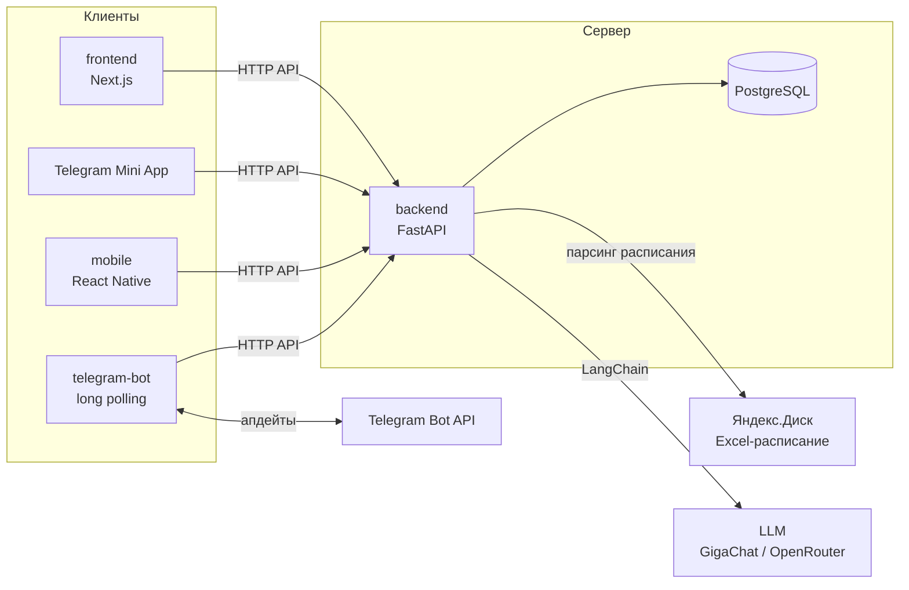
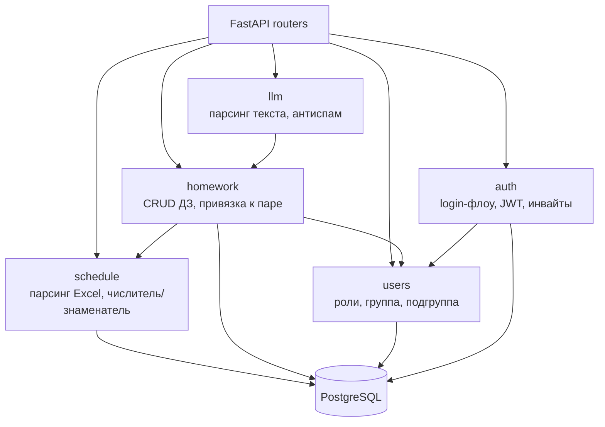
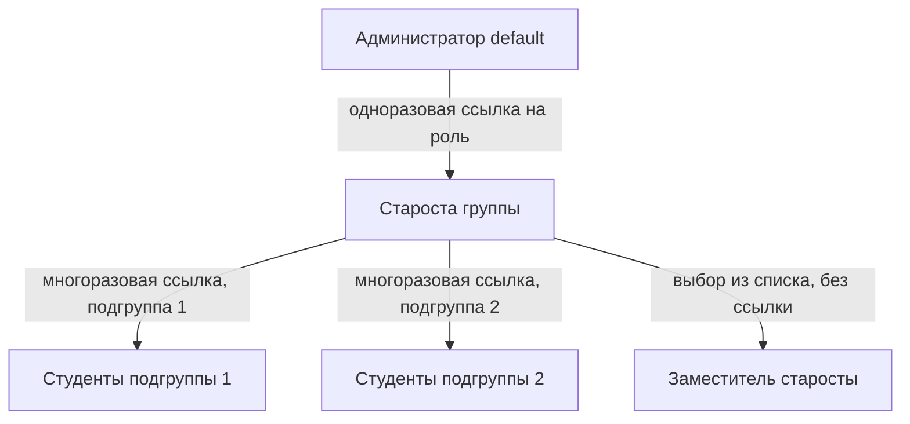
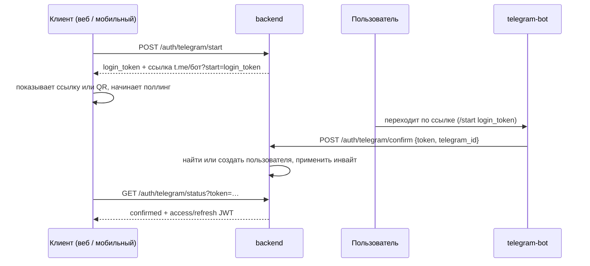
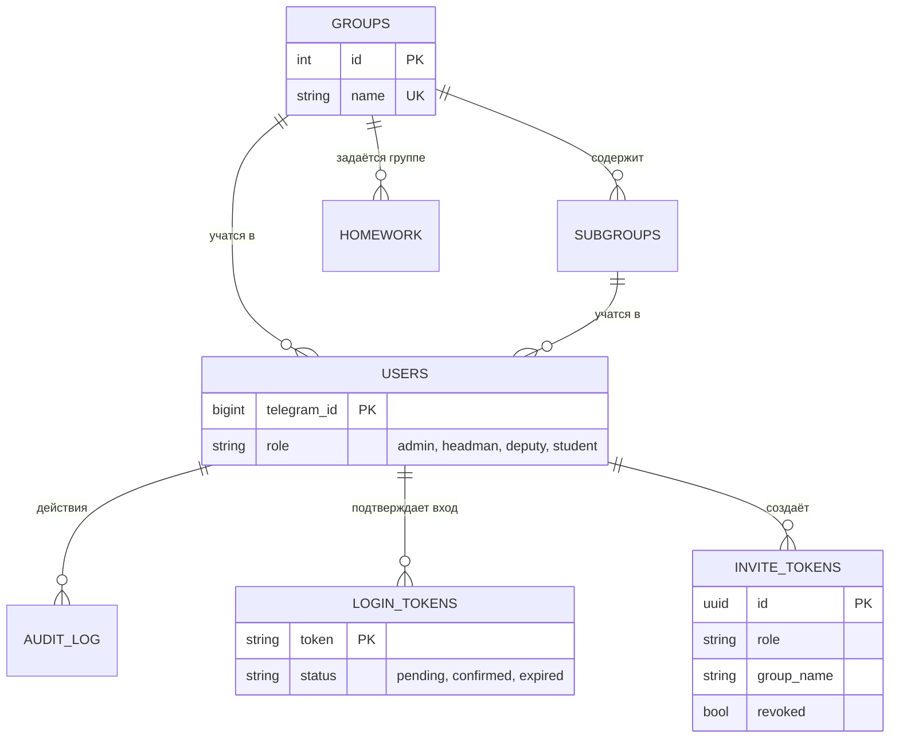
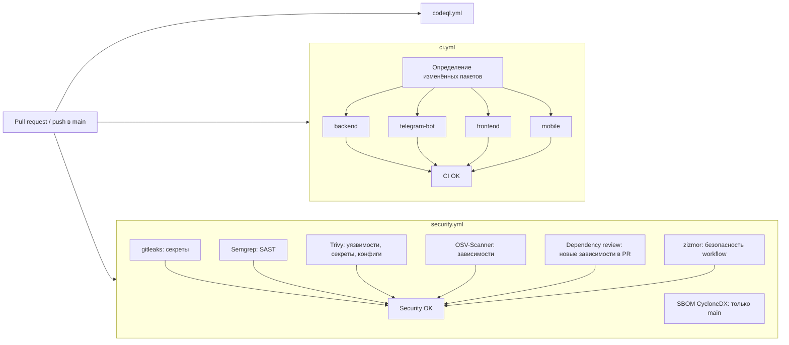

# Zeta

Система учёта домашних заданий студентов ФКН: централизованный сбор, хранение и просмотр ДЗ, привязанных к парам расписания. Расписание берётся из Excel-таблицы на Яндекс.Диске. Вход только по приглашению, идентичность — `telegram_id`.

Требования — [docs/Task.md](docs/Task.md), план и расписание — [docs/Roadmap.md](docs/Roadmap.md) и [docs/stage1](docs/stage1). Правила работы для разработчиков и AI-агентов — [AGENTS.md](AGENTS.md).

## Структура репозитория

Монорепозиторий из четырёх независимых пакетов, без корневого workspace: у каждого свой менеджер зависимостей и lockfile.

| Пакет | Что это | Стек | Владелец |
|---|---|---|---|
| [`backend/`](backend) | API, авторизация, данные, LLM-обвязка | FastAPI, SQLAlchemy (async), Alembic, PostgreSQL, `uv` | Климов |
| [`telegram-bot/`](telegram-bot) | Тонкий клиент Telegram: вход, ввод ДЗ текстом | Python, long polling, `uv` | Ульянченко |
| [`frontend/`](frontend) | Веб-приложение и Telegram Mini App | Next.js (App Router), Tailwind, `pnpm` | Шелудько |
| [`mobile/`](mobile) | Мобильное приложение | React Native (Expo), `pnpm` | Берестнев, Ремезов |

Ревьюеры по умолчанию назначаются через [CODEOWNERS](.github/CODEOWNERS).

## Архитектура

### Компоненты

`backend` — модульный монолит: один процесс, один деплой, единственный владелец БД, авторизации и ролей. Все клиенты ходят в него по единому HTTP API (OpenAPI, contract-first). Бот не содержит бизнес-логики и не обращается к LLM или БД напрямую.



### Модули backend



### Доступ и роли

Свободного доступа нет. Администратор (`default`, заводится сидом на конкретный `telegram_id`) выдаёт одноразовую ссылку старосте; староста выпускает многоразовые ссылки на свои подгруппы; заместителя староста назначает напрямую. Группа и подгруппа проставляются из токена ссылки. Ссылки можно отозвать, все действия с ролями и ДЗ пишутся в аудит. Подробности — [docs/Task.md §3.2](docs/Task.md).



### Вход через Telegram

Telegram Login Widget не подходит (нужен публичный HTTPS-домен), поэтому используется deep-link и поллинг. Это воспроизводится локально без деплоя. Один контракт `/auth/*` и общая пара JWT (access + refresh) для веба, мобильного приложения и бота. Mini App входит по подписанному `initData` через `POST /auth/telegram/webapp` и получает те же токены.



### Данные

Предварительная схема таблиц, которые появятся в первых тикетах (`auth`, `users`, `schedule`, `homework`). Окончательный состав определяют миграции Alembic в `backend/migrations`.



## Быстрый старт

Нужны: `uv`, Node.js 24 с `pnpm`, Docker. Запуск каждого пакета описан в его README.

```bash
# backend + PostgreSQL
cd backend && cp .env.example .env && docker compose up -d --wait
uv sync && uv run alembic upgrade head && uv run uvicorn backend.main:app --reload

# frontend / mobile
cd frontend && pnpm install && pnpm dev
cd mobile && pnpm install && pnpm start

# telegram-bot
cd telegram-bot && uv sync
```

## Проверки

После любой правки в пакете должно быть чисто:

| Пакет | Команда |
|---|---|
| `backend/`, `telegram-bot/` | `uv run ruff check . && uv run ruff format --check . && uv run mypy . && uv run pytest` |
| `frontend/`, `mobile/` | `pnpm lint && pnpm typecheck && pnpm test` |

Работаем по TDD (Red → Green → Refactor), коммиты — Conventional Commits, в `main` только через PR с ревью. Подробно — в [AGENTS.md](AGENTS.md).

## CI и безопасность

Все workflow лежат в [.github/workflows](.github/workflows). Сторонние экшены закреплены по SHA коммита (версия — в комментарии), Dependabot обновляет их раз в неделю с задержкой 7 дней, чтобы не брать только что опубликованные релизы. Права токена по умолчанию — `contents: read`.



| Workflow | Что делает | Когда |
|---|---|---|
| `ci.yml` | Для изменённых пакетов: линт, форматирование, типы, тесты (backend — с PostgreSQL, проверка единственной «головы» миграций и `alembic check`), сборка frontend, аудит зависимостей (`pip-audit`, `pnpm audit`) | PR и push в `main` |
| `security.yml` | gitleaks, Semgrep, Trivy, OSV-Scanner, dependency review, zizmor, SBOM | PR, push в `main`, раз в неделю |
| `codeql.yml` | CodeQL (Python, JS/TS, набор `security-extended`) | PR, push в `main`, раз в неделю |
| `scorecard.yml` | OpenSSF Scorecard — оценка практик безопасности репозитория | push в `main`, раз в неделю |
| `telegram-notify.yml` | Уведомления в Telegram о push/PR/merge | как раньше |

**Required checks для `main`** (Settings → Branches → Branch protection): `CI OK` и `Security OK`. Отдельные джобы обязательными не делаем: при PR, который не трогает пакет, они пропускаются, а пропущенная обязательная проверка блокирует мерж. Заодно стоит включить «Require review from Code Owners» и запрет force push.

Что нужно включить в настройках репозитория: Code scanning (для CodeQL и Scorecard), Dependabot alerts и Dependabot security updates, Secret scanning с push protection.

Локально те же проверки пакета описаны в разделе «Проверки». Известное ограничение: для `braces` и `node-forge` в npm пока нет исправленных версий, поэтому два advisory явно игнорируются в `auditConfig` (`frontend/pnpm-workspace.yaml`, `mobile/pnpm-workspace.yaml`) — это транзитивные dev-зависимости, при выходе фикса записи нужно удалить.
