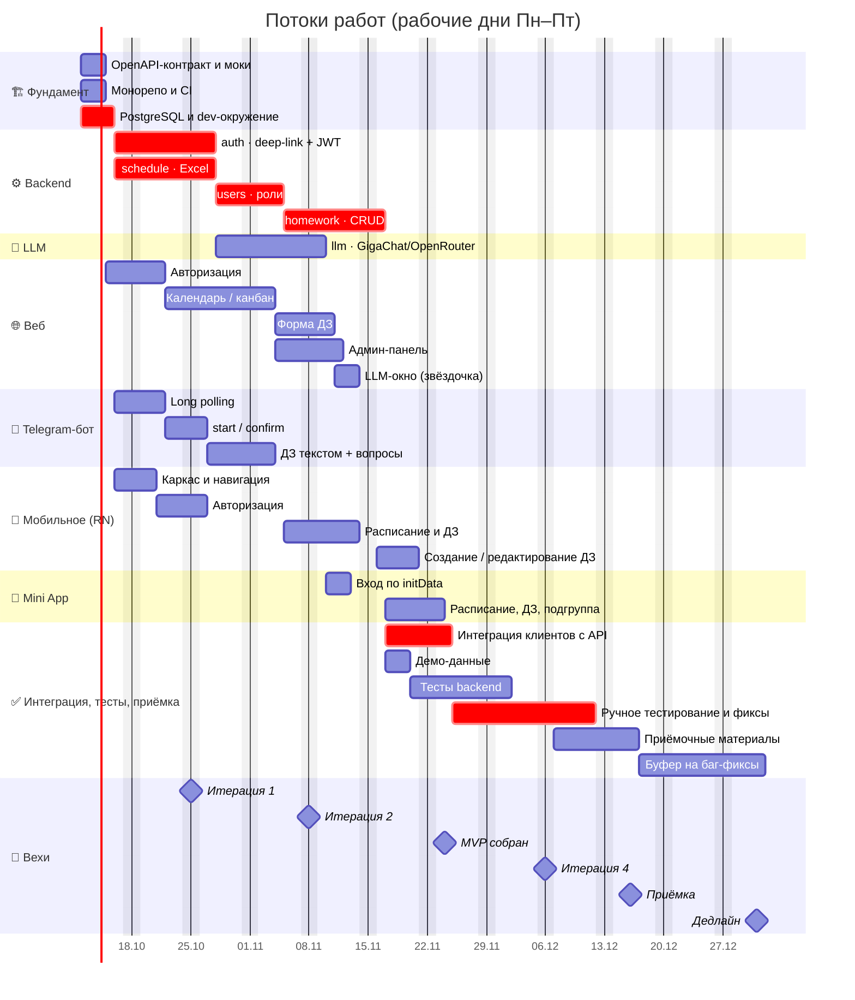
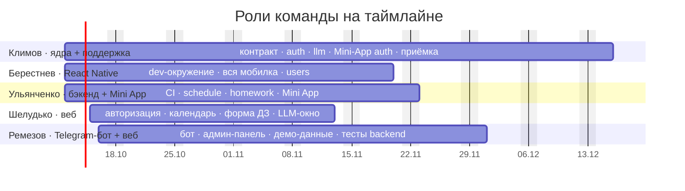

# 🗺️ Zeta — Roadmap

> Система учёта домашних заданий студентов ФКН · **12.10.2026 → 31.12.2026**
> Источник дат и задач: [`stage1/08-расписание-гант.md`](stage1/08-расписание-гант.md) · Объём: [`Task.md`](Task.md) §11

**Цель MVP:** пять рабочих клиентов/слоёв — **backend, веб, Telegram-бот, Telegram Mini App, мобильное приложение** — с настоящей LLM (GigaChat / OpenRouter).

---

## 🧭 Дорога одним взглядом

> **Принцип:** пять человек работают параллельно с первого дня, каждый в своей зоне. Клиенты идут против OpenAPI-контракта и моков и не ждут backend; соединяются в итерации 3. Итерации 1–2 — разработка, 4 и стабилизация — накладка тестов, багов и доделок.

---

## 📅 План по потокам работ

> Красным — критический путь: `3.2 → 4.1 ∥ 4.3 → 4.2 → 4.4 → 8.3 → 8.2`.

---

## 🎯 Что получаем к концу каждой итерации

| Веха | Дата | Результат |
|---|---|---|
| 🟢 **Итерация 1** | 25.10 | Контракт API и моки, CI, dev-окружение; веб, мобилка и бот стартовали параллельно; `auth` и `schedule` — к 27.10 |
| 🟢 **Итерация 2** | 08.11 | `users`; веб, мобилка и бот с LLM — против моков; `homework` и `llm` в работе |
| 🟡 **Итерация 3** | 22.11 | `homework` (16.11), `llm`; все клиенты feature-complete (до 19.11); идёт интеграция |
| 🔵 **MVP собран** | 24.11 | Интеграция завершена: backend, веб, бот, Mini App, мобилка, LLM |
| 🟣 **Приёмка** | 16.12 | Ручное тестирование (до 11.12) и приёмочные материалы |
| 🏁 **Дедлайн** | 31.12 | Буфер 17–31.12: 11 рабочих дней на баг-фиксы и сдачу |

---

## 🧩 Объём: MVP → дальше

---

## 👥 Кто за что

| Участник | Роль | Зона |
|---|---|---|
| **Иван Климов** | Тимлид, архитектор ядер | OpenAPI-контракт, `auth`, `llm`, вход Mini App, приёмка + ревью и помощь везде |
| **Берестнев Алексей** | React Native / бэкенд | dev-окружение, `users`, всё мобильное приложение |
| **Ульянченко Даниил** | Бэкенд / Mini App | CI, `schedule`, `homework`, Mini App |
| **Шелудько Данил** | Веб | авторизация, календарь/канбан, форма ДЗ, LLM-окно |
| **Ремезов Никита** | Telegram-бот / веб | весь бот, админ-панель, тесты backend, демо-данные |

---

## ⚠️ Риски дорожной карты

- **Критическая цепочка** `backend → homework (4.4) → интеграция (8.3)`: задержка съедает буфер. Меры: Климов подключается парно к 4.4 и 8.3. Клиенты зависят от точности OpenAPI-контракта — его ревьюит вся команда.
- **Часы:** номинальный фонд 3 ч/нед на человека (≈ 174 ч), план ≈ 481 ч — на задачах загрузка 5,5–9,5 ч/нед, вне пакетов — учёба. При нехватке времени скоуп режется в порядке: создание ДЗ в мобилке → LLM-окно в вебе → диалоги бота → админ-панель.
- **LLM-провайдер:** бесплатные лимиты GigaChat / OpenRouter и поведение при недоступности — открытый вопрос ТЗ §13.
- **Праздник 04.11** в расписании пока не учтён.
