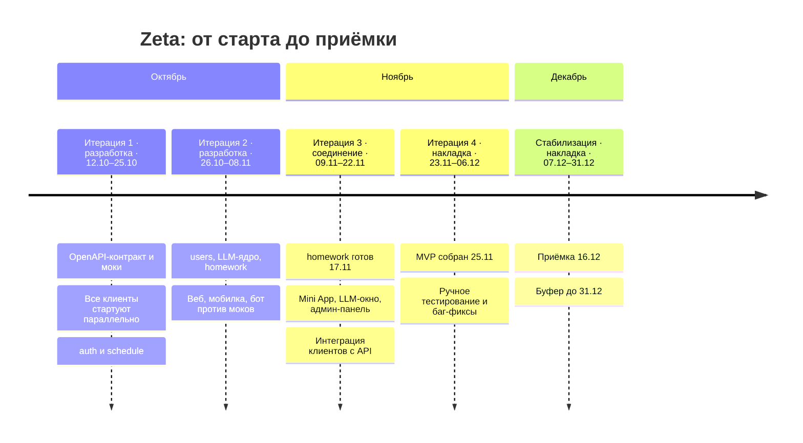
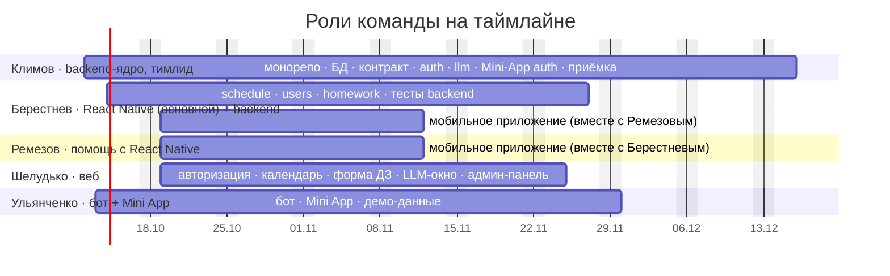

# 🗺️ Zeta — Roadmap

> Система учёта домашних заданий студентов ФКН · **12.10.2026 → 31.12.2026**
> Источник дат и задач: [`stage1/08-расписание-гант.md`](stage1/08-расписание-гант.md) · Объём: [`Task.md`](Task.md) §11

**Цель MVP:** пять рабочих клиентов/слоёв — **backend, веб, Telegram-бот, Telegram Mini App, мобильное приложение** — с настоящей LLM (GigaChat / OpenRouter).

---

## 🧭 Дорога одним взглядом

> **Принцип:** пять человек работают параллельно с первого дня, каждый в своей зоне. Клиенты идут против OpenAPI-контракта и моков и не ждут backend; соединяются в итерации 3. Итерации 1–2 — разработка, 4 и стабилизация — накладка тестов, багов и доделок.



---

## 📅 План по потокам работ

```mermaid
gantt
    title Потоки работ (рабочие дни Пн–Пт)
    dateFormat YYYY-MM-DD
    axisFormat %d.%m
    excludes weekends

    section 🏗 Фундамент
    Монорепо (CI — фоном)        :crit, f1, 2026-10-12, 1d
    БД: PostgreSQL, Alembic      :crit, f2, 2026-10-13, 1d
    OpenAPI-контракт и моки      :crit, f0, 2026-10-14, 3d

    section ⚙️ Backend
    schedule · Excel             :b2, 2026-10-14, 8d
    auth · deep-link + JWT       :crit, b1, 2026-10-19, 8d
    users · роли                 :crit, b3, 2026-10-29, 6d
    homework · CRUD              :crit, b4, 2026-11-06, 8d

    section 🧠 LLM
    llm · GigaChat/OpenRouter    :l1, 2026-10-29, 9d

    section 🌐 Веб
    Авторизация                  :w1, 2026-10-19, 5d
    Календарь / канбан           :w2, 2026-10-26, 9d
    Форма ДЗ                     :w4, 2026-11-06, 5d
    LLM-окно (звёздочка)         :w5, 2026-11-13, 3d
    Админ-панель                 :w3, 2026-11-18, 6d

    section 🤖 Telegram-бот
    BotFather, long polling      :t1, 2026-10-13, 4d
    start / confirm              :t2, 2026-10-19, 3d
    ДЗ текстом + вопросы         :t3, 2026-10-22, 6d

    section 📱 Мобильное (RN)
    Каркас и навигация           :m1, 2026-10-19, 3d
    Авторизация                  :m2, 2026-10-22, 4d
    Расписание и ДЗ              :m3, 2026-10-28, 7d
    Создание / редактирование ДЗ :m4, 2026-11-06, 5d

    section 💬 Mini App
    Расписание, ДЗ, подгруппа    :a2, 2026-11-06, 5d
    Вход по initData             :a1, 2026-11-11, 3d

    section ✅ Интеграция, тесты, приёмка
    Интеграция клиентов с API    :crit, q0, 2026-11-18, 6d
    Тесты backend                :q1, 2026-11-18, 8d
    Демо-данные                  :q2, 2026-11-26, 3d
    Ручное тестирование и фиксы  :crit, q3, 2026-11-26, 13d
    Приёмочные материалы         :q4, 2026-12-07, 8d
    Буфер на баг-фиксы           :q5, 2026-12-17, 11d

    section 🚩 Вехи
    Итерация 1                   :milestone, 2026-10-25, 0d
    Итерация 2                   :milestone, 2026-11-08, 0d
    MVP собран                   :milestone, 2026-11-25, 0d
    Итерация 4                   :milestone, 2026-12-06, 0d
    Приёмка                      :milestone, 2026-12-16, 0d
    Дедлайн                      :milestone, 2026-12-31, 0d
```

> Красным — критический путь: `3.1 → 3.2 → 3.3 → 4.1 → 4.2 → 4.4 → 8.3 → 8.2`.

---

## 🎯 Что получаем к концу каждой итерации

| Веха | Дата | Результат |
|---|---|---|
| 🟢 **Итерация 1** | 25.10 | Монорепо, БД, контракт API и моки; `schedule` (23.10); вход в вебе, мобилке и боте; `auth` — 28.10 |
| 🟢 **Итерация 2** | 08.11 | `users`, календарь в вебе, просмотр в мобилке, диалоги бота; `homework` и `llm` в работе |
| 🟡 **Итерация 3** | 22.11 | `llm` (10.11), Mini App и вход Mini App (до 13.11), `homework` (17.11); интеграция идёт; админ-панель — 25.11 |
| 🔵 **MVP собран** | 25.11 | Интеграция завершена: backend, веб, бот, Mini App, мобилка, LLM |
| 🟣 **Приёмка** | 16.12 | Ручное тестирование (до 14.12) и приёмочные материалы |
| 🏁 **Дедлайн** | 31.12 | Буфер 17–31.12: 11 рабочих дней на баг-фиксы и сдачу |

---

## 🧩 Объём: MVP → дальше

```mermaid
flowchart LR
    subgraph MVP["✅ MVP · собран 25.11, приёмка 16.12.2026"]
        direction TB
        M1["⚙️ Backend<br/>auth · users · schedule · homework"]
        M2["🌐 Веб<br/>календарь · форма ДЗ · админ-панель"]
        M3["🤖 Telegram-бот<br/>вход · ДЗ текстом · вопросы"]
        M4["💬 Mini App<br/>расписание · ДЗ · подгруппа"]
        M5["📱 Мобильное приложение<br/>вход · просмотр · создание ДЗ"]
        M6["🧠 LLM<br/>GigaChat / OpenRouter"]
    end
    subgraph LATER["🔜 Следующие итерации"]
        direction TB
        L1["Заместитель старосты"]
    end
    subgraph FUTURE["🔮 Future"]
        direction TB
        F1["Напоминания / push"]
        F2["Комментарии и статусы"]
        F3["Роль преподавателя"]
        F4["Интеграции с календарями"]
    end
    MVP --> LATER --> FUTURE

    classDef mvp fill:#e8f7ee,stroke:#2e9e5b,color:#14502d
    classDef later fill:#fff6e0,stroke:#d19a1c,color:#5c4208
    classDef future fill:#eef0f6,stroke:#7b86a8,color:#2e3550
    class M1,M2,M3,M4,M5,M6 mvp
    class L1 later
    class F1,F2,F3,F4 future
```



---

## 👥 Кто за что



| Участник | Роль | Зона |
|---|---|---|
| **Иван Климов** | Тимлид, backend-ядро | монорепо и CI, БД (Alembic), OpenAPI-контракт, `auth`, `llm`, вход Mini App, приёмка + ревью и помощь везде |
| **Берестнев Алексей** | React Native (основной), backend | мобильное приложение (вместе с Ремезовым), `schedule`, `users`, `homework`, тесты backend |
| **Ремезов Никита** | Помощь с React Native | только мобильное приложение, вместе с Берестневым; отдельная вспомогательная роль — все мобильные задачи назначаются им обоим |
| **Шелудько Данил** | Веб-фронтенд | авторизация, календарь/канбан, форма ДЗ, LLM-окно, админ-панель |
| **Ульянченко Даниил** | Telegram-бот, Mini App | весь бот, Mini App, демо-данные |

---

## ⚠️ Риски дорожной карты

- **Критическая цепочка** `БД → контракт → auth → users → homework (4.4) → интеграция (8.3)`: задержка съедает буфер; **Берестнев — самая нагруженная роль** (все модули backend подряд), при перегрузке часть задач передаём Ульянченко. Меры: Климов подключается парно к 4.4 и 8.3. Клиенты зависят от точности OpenAPI-контракта — его ревьюит вся команда.
- **Часы:** номинальный фонд 3 ч/нед на человека (≈ 174 ч), план ≈ 481 ч — на задачах загрузка 6–11 ч/нед, вне пакетов — учёба. При нехватке времени скоуп режется в порядке: создание ДЗ в мобилке → LLM-окно в вебе → диалоги бота → админ-панель.
- **LLM-провайдер:** бесплатные лимиты GigaChat / OpenRouter и поведение при недоступности — открытый вопрос ТЗ §13.
- **Праздник 04.11** в расписании пока не учтён.
