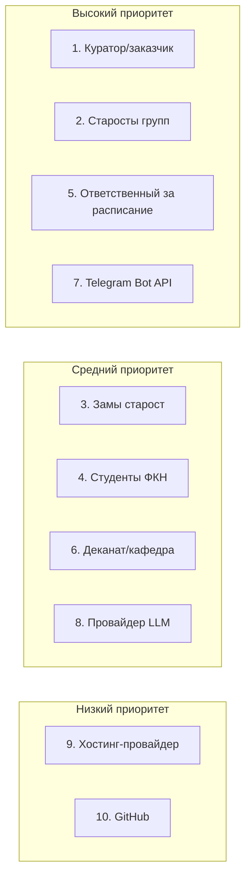
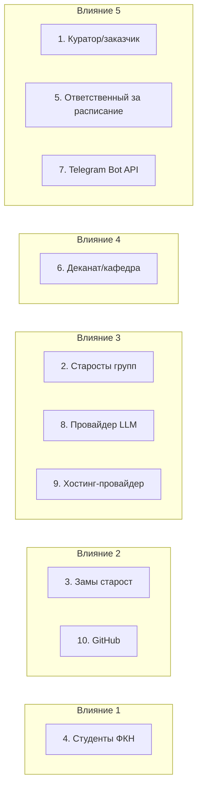
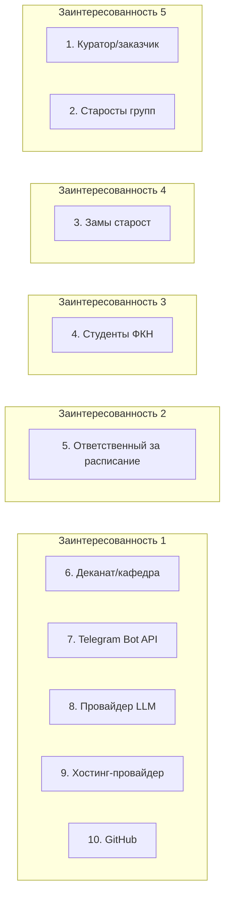

# Реестр заинтересованных сторон

**Фаза:** 2
**Проект:** Zeta — система учёта домашних заданий студентов ФКН
**Требование:** минимум 5 внешних сторон, не считая заказчика и пользователей (Задание §5, Фаза 2)

## Шкалы и обозначения

- **Заинтересованность (1–5)** — насколько сторона вовлечена в проект или зависит от его результата.
- **Влияние (1–5)** — насколько сторона способна повлиять на успех, сроки или объём проекта.
- **Приоритет** — проектное решение команды (не выводится механически из пары «заинтересованность × влияние»): «Высокий» = критично для MVP-приёмки или для самого факта работы системы; «Средний» = важно, но не блокирует; «Низкий» = периферийно.
- **Категория** — заказчик / пользователь / внешний источник данных / регулятор / технологическая зависимость / инфраструктура.
- **★ Внешняя** — строка учитывается в требовании «≥ 5 внешних сторон». Куратор (заказчик) и пользователи в это требование не зачитываются.

## Основная таблица

| # | ЗС | Категория | Заинт. | Влияние | Приоритет | Ожидания | Стратегия взаимодействия | Следствия (требование / риск / ограничение) |
|---|---|---|---|---|---|---|---|---|
| 1 | Преподаватель практики (куратор/приёмка) — он же заказчик | Заказчик | 5 | 5 | Высокий | Полный и своевременный комплект артефактов по каждой фазе и итерации, обоснованные оценки | Демо на парах раз в две недели; любые решения по срокам и объёму — заранее на согласование | Критерии приёмки MVP зафиксированы в [03-устав-проекта.md](03-устав-проекта.md); календарь 4 двухнедельных итераций — жёсткое ограничение (Задание §1) |
| 2 | Старосты групп ФКН | Пользователь (запись) | 5 | 3 | Высокий | Быстрый и понятный ввод ДЗ, без дублирования по подгруппам | Вовлечение в приёмочное тестирование перед стабилизацией MVP (WBS 8.2); сбор обратной связи через бота | Требования к UX формы ДЗ ([../Task.md](../Task.md) §6.1); риск: низкая активность старост = пустая система и провал критерия приёмки «студент видит ДЗ» |
| 3 | Заместители старост | Пользователь (запись) | 4 | 2 | Средний | Те же права внутри группы, что у старосты; назначаются и снимаются старостой из числа студентов своей группы | Функционал вынесен за MVP ([../Task.md](../Task.md) §11) — в реестр включены для полноты, активное взаимодействие начнётся в следующей итерации | Ограничение: в MVP не реализуется (см. [05-иерархическая-структура-работ.md](05-иерархическая-структура-работ.md), WBS 5.4 «Админ-панель» — вне MVP-скоупа по ролям); открытый вопрос «что при смене старосты с заместителем» ([../Task.md](../Task.md) §13) |
| 4 | Студенты ФКН | Пользователь (чтение) | 3 | 1 | Средний | Актуальные ДЗ к ближайшим парам, без лишней регистрации | Информирование через старост и чаты подгрупп при запуске | Требования: разграничение по подгруппам ([../Task.md](../Task.md) §5) и переключение подгруппы — в MVP (§11); критерий приёмки «студент видит ДЗ своей подгруппы» ([03-устав-проекта.md](03-устав-проекта.md)) |
| 5 | Ответственный за публикацию расписания на Яндекс.Диске (методист/диспетчерская ФКН) | Внешний источник данных ★ | 2 | 5 | Высокий | — (не в курсе про Zeta) | Мониторинг структуры файла; при смене формата — алерт парсинга + ручная проверка; прямой контакт в MVP не устанавливаем | Риск: смена структуры Excel ломает парсинг ([../Task.md](../Task.md) §4); контракт данных (5 листов, поля) уже зафиксирован в ТЗ; WBS 4.3 «schedule», 8.2 «ручное тестирование MVP» |
| 6 | Деканат/кафедра ФКН | Регулятор по данным ★ | 1 | 4 | Средний | Система не должна выглядеть как официальный источник учебной информации или электронный журнал | Явная оговорка в UI и документации; никаких оценок и посещаемости | Ограничение: «не электронный журнал и не официальный источник» ([../Task.md](../Task.md) §1); персональные данные в смысле 152-ФЗ не собираются (§8) |
| 7 | Telegram (платформа и Bot API) | Технологическая зависимость ★ | 1 | 5 | Высокий | Стабильный Bot API, long polling без ограничений | Мониторинг changelog Bot API; отсутствие завязки на публичный HTTPS-домен и TLS-сертификат | Single point of failure: вся авторизация построена на deep-link через бота ([../Task.md](../Task.md) §3.3); WBS 3.2 «бот в BotFather», 6.2 «Long polling инфраструктура» |
| 8 | Провайдер LLM (GigaChat / OpenRouter, бесплатный тариф) | Технологическая зависимость ★ | 1 | 3 | Средний | — | Ограничение нагрузки; заложить деградацию при исчерпании лимита; в MVP не используется | Бюджет 0, бесплатные тарифы ([../Task.md](../Task.md) §8); поведение при исчерпании лимита — открытый вопрос (§13); WBS 4.5 «llm-заглушка» — интерфейс без реальной логики |
| 9 | Хостинг-провайдер | Технологическая зависимость ★ | 1 | 3 | Низкий | — | Выбор отложен до Фазы 3/4 и следующей итерации | Открытый вопрос ([../Task.md](../Task.md) §13); до выбора провайдера деплой не планируется |
| 10 | GitHub (репозиторий, CI) | Инфраструктура ★ | 1 | 2 | Низкий | Публичный репозиторий, стабильный CI | Публичный репозиторий по умолчанию; CI на тесты и алерты о движении в репо | Требование [../Task.md](../Task.md) §10; конкретная CI-платформа не зафиксирована в ТЗ — открытый вопрос; WBS 3.1 «Монорепозиторий и CI» |

**Итог по требованию «≥ 5 внешних сторон»:** отмечено шесть строк (5–10). Куратор (заказчик) и пользователи (старосты, заместители, студенты) в это требование не зачитываются.

## Матрица Менделоу (влияние × заинтересованность)

Ниже — три пирамиды по данным основной таблицы: приоритет (проектное решение команды), влияние и заинтересованность (шкалы 1–5). Вершина пирамиды — наивысший уровень, основание — низший.

### Пирамида по приоритету

### Пирамида по влиянию (1–5)

### Пирамида по заинтересованности (1–5)

