# Иерархическая структура работ (ИСР / WBS)

**Фаза:** 2
**Проект:** Zeta
**Требование:** минимум 3 уровня, порядка 20–25 пакетов работ (листовых узлов) (Задание §5, Фаза 2)

## Принцип декомпозиции

Смешанный: верхний уровень — по функциональным зонам/модулям бэкенда и клиентам (совпадает со структурой репозитория `../Task.md` §10.1–10.2), внутри — по жизненному циклу (аналитика → инфраструктура → реализация → тестирование → приёмка).

9 групп 2-го уровня, **24 пакета работ** (листовых узла) 3-го уровня. Декомпозиция охватывает весь проект, а не только продукт: группа 1 — управленческие работы, группа 9 — приёмочные процедуры и демо-данные, группа 3 — среда и инструменты.

```mermaid
graph TD
    ROOT[Zeta MVP] --> G1[1. Управление проектом]
    ROOT --> G2[2. Аналитика и дизайн]
    ROOT --> G3[3. Инфраструктура и окружение]
    ROOT --> G4[4. Backend]
    ROOT --> G5[5. Frontend веб]
    ROOT --> G6[6. Telegram-бот]
    ROOT --> G7[7. Mobile]
    ROOT --> G8[8. Тестирование]
    ROOT --> G9[9. Приёмка и сдача]

    G1 --> W11[1.1 Устав, ИСР, реестры]
    G1 --> W12[1.2 Ведение трекера]
    G1 --> W13[1.3 Демо и отчётность по итерациям]

    G2 --> W21[2.1 ТЗ и концепт продукта]
    G2 --> W22[2.2 Story map и бэклог продукта]
    G2 --> W23[2.3 UI-черновики]

    G3 --> W31[3.1 Монорепозиторий и CI]
    G3 --> W32[3.2 PostgreSQL, dev-окружение, бот в BotFather]

    G4 --> W41[4.1 auth]
    G4 --> W42[4.2 users]
    G4 --> W43[4.3 schedule]
    G4 --> W44[4.4 homework]
    G4 --> W45[4.5 llm-заглушка]

    G5 --> W51[5.1 Экран авторизации]
    G5 --> W52[5.2 Календарь/канбан]
    G5 --> W53[5.3 Форма ДЗ]
    G5 --> W54[5.4 Админ-панель]

    G6 --> W61[6.1 Обработка start/confirm]
    G6 --> W62[6.2 Long polling инфраструктура]

    G7 --> W71[7.1 Прототип структуры проекта]

    G8 --> W81[8.1 Unit/e2e-тесты backend]
    G8 --> W82[8.2 Ручное тестирование MVP]

    G9 --> W91[9.1 Демо-данные]
    G9 --> W92[9.2 Приёмочные материалы]
```

## Расшифровка пакетов, где не очевидно из названия

- **4.5 llm-заглушка** — интерфейс/адаптер под будущую LLM-интеграцию (`../Task.md` §8), в MVP без реальной логики.
- **7.1 Прототип структуры проекта** — архитектурная закладка React Native-приложения без функционала (`../Task.md` §11).
- **9.1 Демо-данные** — синтетические данные расписания/ДЗ для приёмки, не зависящие от реального парсинга.

ID пакетов задуманы как сквозные ссылки для последующих артефактов Фазы 3 (сводная таблица оценок, сетевой график PERT) и Фазы 4 (story map, бэклог) — они пока не сдаются в рамках этого комплекта.
