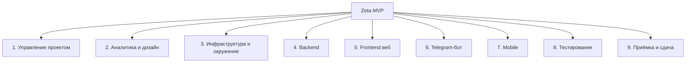

# Иерархическая структура работ (ИСР / WBS)

**Фаза:** 2
**Проект:** Zeta
**Требование:** минимум 3 уровня, порядка 20–25 пакетов работ (листовых узлов) (Задание §5, Фаза 2)

## Принцип декомпозиции

Смешанный: верхний уровень — по функциональным зонам/модулям бэкенда и клиентам (совпадает со структурой репозитория `../Task.md` §10.1–10.2), внутри — по жизненному циклу (аналитика → инфраструктура → реализация → тестирование → приёмка).

9 групп 2-го уровня, **24 пакета работ** (листовых узла) 3-го уровня. Декомпозиция охватывает весь проект, а не только продукт: группа 1 — управленческие работы, группа 9 — приёмочные процедуры и демо-данные, группа 3 — среда и инструменты.

Верхний уровень — на схеме, детализация до листовых пакетов — в таблице ниже (так читается компактнее, чем один разросшийся граф на 34 узла).

| Группа | ID | Пакет работ (лист 3-го уровня) |
|---|---|---|
| 1. Управление проектом | 1.1 | Устав, ИСР, реестры |
| | 1.2 | Ведение трекера |
| | 1.3 | Демо и отчётность по итерациям |
| 2. Аналитика и дизайн | 2.1 | ТЗ и концепт продукта |
| | 2.2 | Story map и бэклог продукта |
| | 2.3 | UI-черновики |
| 3. Инфраструктура и окружение | 3.1 | Монорепозиторий и CI |
| | 3.2 | PostgreSQL, dev-окружение, бот в BotFather |
| 4. Backend | 4.1 | auth |
| | 4.2 | users |
| | 4.3 | schedule |
| | 4.4 | homework |
| | 4.5 | llm-заглушка |
| 5. Frontend веб | 5.1 | Экран авторизации |
| | 5.2 | Календарь/канбан |
| | 5.3 | Форма ДЗ |
| | 5.4 | Админ-панель |
| 6. Telegram-бот | 6.1 | Обработка start/confirm |
| | 6.2 | Long polling инфраструктура |
| 7. Mobile | 7.1 | Прототип структуры проекта |
| 8. Тестирование | 8.1 | Unit/e2e-тесты backend |
| | 8.2 | Ручное тестирование MVP |
| 9. Приёмка и сдача | 9.1 | Демо-данные |
| | 9.2 | Приёмочные материалы |

## Расшифровка пакетов, где не очевидно из названия

- **4.5 llm-заглушка** — интерфейс/адаптер под будущую LLM-интеграцию (`../Task.md` §8), в MVP без реальной логики.
- **7.1 Прототип структуры проекта** — архитектурная закладка React Native-приложения без функционала (`../Task.md` §11).
- **9.1 Демо-данные** — синтетические данные расписания/ДЗ для приёмки, не зависящие от реального парсинга.

ID пакетов задуманы как сквозные ссылки для последующих артефактов Фазы 3 (сводная таблица оценок, сетевой график PERT) и Фазы 4 (story map, бэклог) — они пока не сдаются в рамках этого комплекта.
