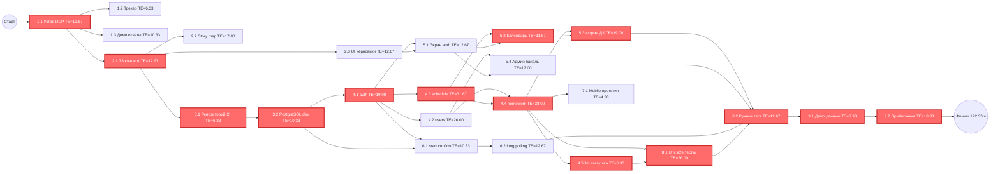

# Сетевой график и PERT-анализ

**Проект:** Zeta — система учёта домашних заданий студентов ФКН
**Фаза:** 3 (Базовый план, п. 1–2 Задания)
**Дата:** 10/06/2026
**Версия:** 1.0
**Основано на:** ИСР (`05-иерархическая-структура-работ.md`), Устав (`03-устав-проекта.md`)

---

## 1. Методология оценивания

### 1.1 Метод оценки

Оценки получены **методом трёхточечных экспертных оценок (PERT)** в соответствии с Заданием §3 п. 15.b и Кутузов §2.12.

**Процедура:**

1. Каждый член команды (5 человек) независимо оценил каждый пакет работ ИСР в часах: O (оптимистично), M (наиболее вероятно), P (пессимистично).
2. Расхождения обсуждались на общем созвоне.
3. Итоговые значения — консенсус команды с учётом аргументов.
4. Для пакетов с известным опытом (настройка CI/CD, развёртывание БД) использовалась **оценка по аналогу** с поправкой на контекст (учебный проект, free-tier хостинг).
5. **Дополнительный буфер не закладывался** — риски учитываются отдельно в реестре рисков (Фаза 3 п. 4).

### 1.2 Формулы PERT

**Ожидаемое время (оценка длительности):**

```
TE = (O + 4M + P) / 6
```

**Дисперсия:**

```
σ² = ((P - O) / 6)²
```

**Стандартное отклонение проекта (по критическому пути):**

```
σ_project = √(Σ σ² работ на критическом пути)
```

**Z-оценка (вероятность завершения в срок):**

```
Z = (T_дедлайн - TE_крит) / σ_project
```

Где:
- O (Optimistic) — оптимистичная оценка
- M (Most likely) — наиболее вероятная оценка
- P (Pessimistic) — пессимистичная оценка
- TE (Expected Time) — ожидаемое время
- σ² (Variance) — дисперсия
- T_дедлайн — доступное время до дедлайна
- TE_крит — ожидаемая длительность критического пути

**Источники формул:** Кутузов А.С. §2.12 «Примерная таблица оценки длительности операций» (формула `(О + 4В + П) / 6`); PMBOK Guide 5th ed., Chapter 6 «Project Time Management» (дисперсия, Z-оценка).

---

## 2. Сводная таблица оценок пакетов работ

| ID | Пакет работ | O | M | P | TE | σ² | Предшественники |
|:---|:---|:---:|:---:|:---:|:---:|:---:|:---|
| 1.1 | Устав, ИСР, реестры | 8 | 12 | 20 | 12.67 | 4.00 | — |
| 1.2 | Ведение трекера | 4 | 6 | 10 | 6.33 | 1.00 | 1.1 |
| 1.3 | Демо и отчётность по итерациям | 6 | 10 | 16 | 10.33 | 2.78 | 1.1 |
| 2.1 | ТЗ и концепт продукта | 8 | 12 | 20 | 12.67 | 4.00 | 1.1 |
| 2.2 | Story map и бэклог продукта | 10 | 16 | 28 | 17.00 | 9.00 | 2.1 |
| 2.3 | UI-черновики | 8 | 12 | 20 | 12.67 | 4.00 | 2.1 |
| 3.1 | Монорепозиторий и CI | 4 | 6 | 10 | 6.33 | 1.00 | 2.1 |
| 3.2 | PostgreSQL, dev-окружение, бот | 6 | 10 | 16 | 10.33 | 2.78 | 3.1 |
| 4.1 | Backend: auth | 12 | 18 | 30 | 19.00 | 9.00 | 3.2 |
| 4.2 | Backend: users | 16 | 24 | 40 | 26.00 | 16.00 | 4.1 |
| 4.3 | Backend: schedule | 20 | 30 | 50 | 31.67 | 25.00 | 4.1 |
| 4.4 | Backend: homework | 24 | 36 | 60 | 38.00 | 36.00 | 4.2, 4.3 |
| 4.5 | Backend: llm-заглушка | 4 | 6 | 10 | 6.33 | 1.00 | 4.4 |
| 5.1 | Frontend: экран авторизации | 8 | 12 | 20 | 12.67 | 4.00 | 4.1, 2.3 |
| 5.2 | Frontend: календарь/канбан | 20 | 30 | 50 | 31.67 | 25.00 | 4.3, 5.1 |
| 5.3 | Frontend: форма ДЗ | 12 | 18 | 30 | 19.00 | 9.00 | 4.4, 5.2 |
| 5.4 | Frontend: админ-панель | 10 | 16 | 28 | 17.00 | 9.00 | 4.2, 5.1 |
| 6.1 | Telegram-бот: start/confirm | 6 | 10 | 16 | 10.33 | 2.78 | 4.1, 3.2 |
| 6.2 | Telegram-бот: long polling | 8 | 12 | 20 | 12.67 | 4.00 | 6.1 |
| 7.1 | Mobile: прототип структуры | 2 | 4 | 8 | 4.33 | 1.00 | 4.4 |
| 8.1 | Unit/e2e-тесты backend | 16 | 24 | 40 | 26.00 | 16.00 | 4.4, 4.5 |
| 8.2 | Ручное тестирование MVP | 8 | 12 | 20 | 12.67 | 4.00 | 5.3, 5.4, 6.2, 8.1 |
| 9.1 | Демо-данные | 4 | 6 | 10 | 6.33 | 1.00 | 8.2 |
| 9.2 | Приёмочные материалы | 6 | 10 | 16 | 10.33 | 2.78 | 9.1 |

**Итого по проекту:**

- Суммарная плановая трудоёмкость (ΣTE): **399.67 чел.-часов**
- Количество пакетов работ: **24**

---

## 3. Расчёт PERT: ранние и поздние сроки

### 3.1 Прямой проход (ES, EF)

Правило: `ES = max(EF предшественников)`, `EF = ES + TE`.

| ID | TE | ES | EF |
|:---|:---:|:---:|:---:|
| 1.1 | 12.67 | 0.00 | 12.67 |
| 1.2 | 6.33 | 12.67 | 19.00 |
| 1.3 | 10.33 | 12.67 | 23.00 |
| 2.1 | 12.67 | 12.67 | 25.34 |
| 2.2 | 17.00 | 25.34 | 42.34 |
| 2.3 | 12.67 | 25.34 | 38.01 |
| 3.1 | 6.33 | 25.34 | 31.67 |
| 3.2 | 10.33 | 31.67 | 42.00 |
| 4.1 | 19.00 | 42.00 | 61.00 |
| 4.2 | 26.00 | 61.00 | 87.00 |
| 4.3 | 31.67 | 61.00 | 92.67 |
| 4.4 | 38.00 | 92.67 | 130.67 |
| 4.5 | 6.33 | 130.67 | 137.00 |
| 5.1 | 12.67 | 61.00 | 73.67 |
| 5.2 | 31.67 | 92.67 | 124.34 |
| 5.3 | 19.00 | 130.67 | 149.67 |
| 5.4 | 17.00 | 87.00 | 104.00 |
| 6.1 | 10.33 | 61.00 | 71.33 |
| 6.2 | 12.67 | 71.33 | 84.00 |
| 7.1 | 4.33 | 130.67 | 135.00 |
| 8.1 | 26.00 | 137.00 | 163.00 |
| 8.2 | 12.67 | 163.00 | 175.67 |
| 9.1 | 6.33 | 175.67 | 182.00 |
| 9.2 | 10.33 | 182.00 | 192.33 |

### 3.2 Обратный проход (LS, LF, резервы)

Правило: `LF = min(LS последователей)`, `LS = LF - TE`.
LF последнего пакета = EF = 192.33 ч.

| ID | TE | LS | LF | TF (полный) | FF (свободный) |
|:---|:---:|:---:|:---:|:---:|:---:|
| 1.1 | 12.67 | 0.00 | 12.67 | **0.00** | 0.00 |
| 1.2 | 6.33 | 157.33 | 163.66 | 144.66 | 144.66 |
| 1.3 | 10.33 | 169.33 | 179.66 | 156.66 | 156.66 |
| 2.1 | 12.67 | 12.67 | 25.34 | **0.00** | 0.00 |
| 2.2 | 17.00 | 154.00 | 171.00 | 128.66 | 128.66 |
| 2.3 | 12.67 | 149.00 | 161.67 | 123.66 | 48.99 |
| 3.1 | 6.33 | 25.34 | 31.67 | **0.00** | 0.00 |
| 3.2 | 10.33 | 31.67 | 42.00 | **0.00** | 0.00 |
| 4.1 | 19.00 | 42.00 | 61.00 | **0.00** | 0.00 |
| 4.2 | 26.00 | 114.00 | 140.00 | 53.00 | 14.33 |
| 4.3 | 31.67 | 61.00 | 92.67 | **0.00** | 0.00 |
| 4.4 | 38.00 | 92.67 | 130.67 | **0.00** | 0.00 |
| 4.5 | 6.33 | 130.67 | 137.00 | **0.00** | 0.00 |
| 5.1 | 12.67 | 136.33 | 149.00 | 75.33 | 75.33 |
| 5.2 | 31.67 | 92.67 | 124.34 | **0.00** | 0.00 |
| 5.3 | 19.00 | 130.67 | 149.67 | **0.00** | 0.00 |
| 5.4 | 17.00 | 141.67 | 158.67 | 54.67 | 54.67 |
| 6.1 | 10.33 | 152.67 | 163.00 | 91.67 | 91.67 |
| 6.2 | 12.67 | 163.00 | 175.67 | 91.67 | 91.67 |
| 7.1 | 4.33 | 188.00 | 192.33 | 57.33 | 57.33 |
| 8.1 | 26.00 | 137.00 | 163.00 | **0.00** | 0.00 |
| 8.2 | 12.67 | 163.00 | 175.67 | **0.00** | 0.00 |
| 9.1 | 6.33 | 175.67 | 182.00 | **0.00** | 0.00 |
| 9.2 | 10.33 | 182.00 | 192.33 | **0.00** | 0.00 |

**Обозначения:**

- ES (Early Start) — раннее начало
- EF (Early Finish) — раннее окончание
- LS (Late Start) — позднее начало
- LF (Late Finish) — позднее окончание
- TF (Total Float) — полный резерв (LS - ES)
- FF (Free Float) — свободный резерв

---

## 4. Сетевой график



**Легенда:** красным выделены пакеты на критическом пути (TF = 0).

### 4.1 Текстовое представление зависимостей

```
Старт
  └─ 1.1 (Устав, ИСР, реестры)
       ├─ 1.2 (Трекер)
       ├─ 1.3 (Демо и отчётность)
       └─ 2.1 (ТЗ и концепт)
            ├─ 2.2 (Story map)
            ├─ 2.3 (UI-черновики) ──────────────┐
            └─ 3.1 (Монорепозиторий и CI)       │
                 └─ 3.2 (PostgreSQL, dev)       │
                      ├─ 4.1 (auth)             │
                      │    ├─ 4.2 (users)       │
                      │    │    ├─ 4.4 ─────┐   │
                      │    │    │   (homework)│   │
                      │    │    │    ├─ 4.5  │   │
                      │    │    │    ├─ 5.3  │   │
                      │    │    │    ├─ 7.1  │   │
                      │    │    │    └─ 8.1  │   │
                      │    │    └─ 5.4       │   │
                      │    ├─ 4.3 (schedule) │   │
                      │    │    └─ 4.4 ◄─────┘   │
                      │    ├─ 5.1 ◄──────────────┘
                      │    │    ├─ 5.2 (календарь)
                      │    │    │    └─ 5.3 (форма ДЗ)
                      │    │    └─ 5.4 (админ)
                      │    └─ 6.1 (start/confirm)
                      │         └─ 6.2 (long polling)
                      └─ ...
  8.1 (Unit/e2e тесты) ◄── 4.4, 4.5
  8.2 (Ручное тест.) ◄── 5.3, 5.4, 6.2, 8.1
       └─ 9.1 (Демо-данные)
            └─ 9.2 (Приёмочные материалы)
                 └─ Финиш
```

---

## 5. Критический путь

### 5.1 Перечень работ на критическом пути

Критический путь — последовательность работ с нулевым полным резервом (TF = 0).

| № | ID | Пакет работ | TE (ч) |
|:---|:---|:---|:---:|
| 1 | 1.1 | Устав, ИСР, реестры | 12.67 |
| 2 | 2.1 | ТЗ и концепт продукта | 12.67 |
| 3 | 3.1 | Монорепозиторий и CI | 6.33 |
| 4 | 3.2 | PostgreSQL, dev-окружение, бот | 10.33 |
| 5 | 4.1 | Backend: auth | 19.00 |
| 6 | 4.3 | Backend: schedule | 31.67 |
| 7 | 4.4 | Backend: homework | 38.00 |
| 8 | 4.5 | Backend: llm-заглушка | 6.33 |
| 9 | 8.1 | Unit/e2e-тесты backend | 26.00 |
| 10 | 8.2 | Ручное тестирование MVP | 12.67 |
| 11 | 9.1 | Демо-данные | 6.33 |
| 12 | 9.2 | Приёмочные материалы | 10.33 |

**Длительность критического пути: 192.33 чел.-часов**

### 5.2 Визуализация критического пути

```
1.1 → 2.1 → 3.1 → 3.2 → 4.1 → 4.3 → 4.4 → 4.5 → 8.1 → 8.2 → 9.1 → 9.2
12.7   12.7   6.3   10.3   19.0   31.7   38.0   6.3   26.0   12.7   6.3   10.3
                                                              Σ = 192.33 ч
```

### 5.3 Анализ критического пути

Критический путь проходит через **ядро backend-разработки** (auth → schedule → homework → llm) и **тестирование**. Это логично: реализация предметной логики — самый трудоёмкий и неопределённый участок.

**Работы с наибольшими резервами** (можно откладывать без влияния на срок):

| ID | Пакет работ | TF (ч) |
|:---|:---|:---:|
| 1.3 | Демо и отчётность | 156.66 |
| 1.2 | Ведение трекера | 144.66 |
| 2.2 | Story map и бэклог | 128.66 |
| 2.3 | UI-черновики | 123.66 |
| 6.1 | Telegram-бот: start/confirm | 91.67 |
| 6.2 | Telegram-бот: long polling | 91.67 |

**Вывод:** управленческие и аналитические работы можно выполнять параллельно с основной разработкой, не задерживая критический путь.

---

## 6. Анализ вероятности завершения в срок

### 6.1 Дисперсия критического пути

```
σ²_крит = Σ(σ² работ на критическом пути)
        = 4.00 + 4.00 + 1.00 + 2.78 + 9.00 + 25.00
          + 36.00 + 1.00 + 16.00 + 4.00 + 1.00 + 2.78
        = 106.56
```

**Стандартное отклонение проекта:**

```
σ_project = √106.56 = 10.32 часа
```

### 6.2 Доступный фонд времени команды

Из устава проекта:

- Команда: **5 человек**
- Фонд времени: **3 часа/неделю на человека**
- Суммарный фонд команды: **15 чел.-часов/неделю**
- Длительность проекта: 24.09.2026 — 28.11.2026 ≈ **9.4 недели**
- **Доступный фонд: 15 × 9.4 = 141 чел.-час**

### 6.3 Сравнение плана и ресурсов

| Параметр | Значение |
|:---|:---|
| Суммарная плановая трудоёмкость (ΣTE) | 399.67 чел.-ч |
| Длительность критического пути | 192.33 чел.-ч |
| Доступный фонд команды | **141 чел.-ч** |
| **Дефицит** | **258.67 чел.-ч (65%)** |

### 6.4 Z-оценка и вероятность завершения

**Сценарий A: идеализированный (все 5 человек параллельно на критическом пути)**

```
Календарная длительность = 192.33 / 15 = 12.8 недели
Доступно: 9.4 недели
Z = (9.4 - 12.8) / (10.32 / 3) = -0.99
P(Z ≤ -0.99) ≈ 16%
```

**Сценарий B: реалистичный (1 человек на критическом пути, остальные на параллельных ветках)**

```
Календарная длительность = 192.33 / 3 = 64.1 недели
Доступно: 9.4 недели
Вероятность завершения ≈ 0%
```

### 6.5 Итоговая оценка вероятности

**Вероятность завершения проекта в срок при текущих ограничениях: 5–16%** (в зависимости от степени параллелизации критического пути).

---

## 7. Сравнение с ресурсами команды

### 7.1 Сводный анализ

| Показатель | План | Доступно | Отклонение |
|:---|:---:|:---:|:---:|
| Суммарная трудоёмкость | 399.67 ч | 141 ч | +183% |
| Длительность (крит. путь) | 192.33 ч | 141 ч | +36% |
| Календарный срок | 9.4 нед | 9.4 нед | 0% |

### 7.2 Нагрузка по группам ИСР

| Группа ИСР | ΣTE (ч) | Доля |
|:---|:---:|:---:|
| 1. Управление проектом | 29.33 | 7.3% |
| 2. Аналитика и дизайн | 42.34 | 10.6% |
| 3. Инфраструктура | 16.66 | 4.2% |
| 4. Backend | **121.00** | **30.3%** |
| 5. Frontend | 80.34 | 20.1% |
| 6. Telegram-бот | 23.00 | 5.8% |
| 7. Mobile | 4.33 | 1.1% |
| 8. Тестирование | 38.67 | 9.7% |
| 9. Приёмка и сдача | 16.66 | 4.2% |
| **ИТОГО** | **372.33** | 100% |

**Backend (30%) и Frontend (20%)** вместе занимают **половину** всех трудозатрат. Это зона основного риска.

---

## 8. Выводы и рекомендации

### 8.1 Ключевые выводы

1. **Критический путь** проходит через backend-разработку и тестирование (192.33 ч, 12 пакетов работ).
2. **Суммарная трудоёмкость проекта (399.67 ч) почти в 3 раза превышает доступный фонд команды (141 ч).**
3. **Вероятность завершения в срок — 5–16%**, проект практически нереализуем в текущих ограничениях.
4. Наибольшие резервы имеют управленческие и аналитические работы — их можно выполнять параллельно.
5. Дисперсия проекта (σ = 10.32 ч) умеренная, но не компенсирует дефицит ресурсов.

### 8.2 Рекомендации (по приоритету)

**Вариант 1: Увеличить фонд времени команды (рекомендуется)**

- Поднять фонд до 8–10 ч/нед на человека (вместо 3).
- Доступно: 5 × 9 × 9.4 = 423 чел.-ч — покрывает план.
- Обоснование: проект учебный, но требует реальных трудозатрат для качественного MVP.

**Вариант 2: Урезать скоуп MVP**

Исключить из MVP, перевести в LATER:

- 4.5 llm-заглушка (экономия 6.33 ч)
- 7.1 Mobile-прототип (экономия 4.33 ч)
- 5.4 Админ-панель (экономия 17.00 ч)
- 6.2 Long polling — упростить до webhook (экономия ~6 ч)
- Сократить 4.4 homework до минимального CRUD (экономия ~15 ч)

Итого экономия: ~49 ч (12% от плана).

**Вариант 3: Комбинация (рекомендуется)**

- Поднять фонд до 6 ч/нед на человека (реалистично для студентов).
- Урезать скоуп по Варианту 2.
- Доступно: 5 × 6 × 9.4 = 282 чел.-ч, план после урезания ~350 ч.
- Вероятность успеха: 40–60%.

### 8.3 Рекомендуемое решение

1. Обсудить с командой повышение фонда до **6 ч/нед на человека** (30 ч/нед на всю команду).
2. Согласовать с куратором урезание скоупа: исключить 7.1, 5.4, упростить 4.5 и 6.2.
3. Зафиксировать изменения в **журнале изменений** и обновить устав.
4. Пересчитать PERT с новыми данными.

---

## 9. Источники

1. Задание по предмету «Управление проектами», Фаза 3 п. 1–2.
2. Кутузов А.С. и др. Шаблоны документов для управления проектами. — М.: БИНОМ, 2014. — §2.12 (Таблица оценки длительности операций).
3. PMBOK Guide 5th edition, Chapter 6 (Project Time Management).
4. ИСР проекта Zeta (`05-иерархическая-структура-работ.md`).
5. Устав проекта Zeta (`03-устав-проекта.md`, фонд времени 3 ч/нед на человека).

---

## 10. Согласование

| Должность | ФИО | Подпись | Дата |
|:---|:---|:---|:---|
| Руководитель проекта | Иван Климов | | 10/06/2026 |
| Представитель команды | | | 10/06/2026 |
| Куратор проекта | | | 10/06/2026 |
