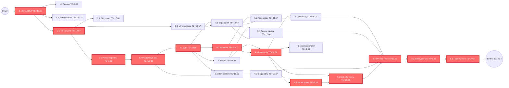
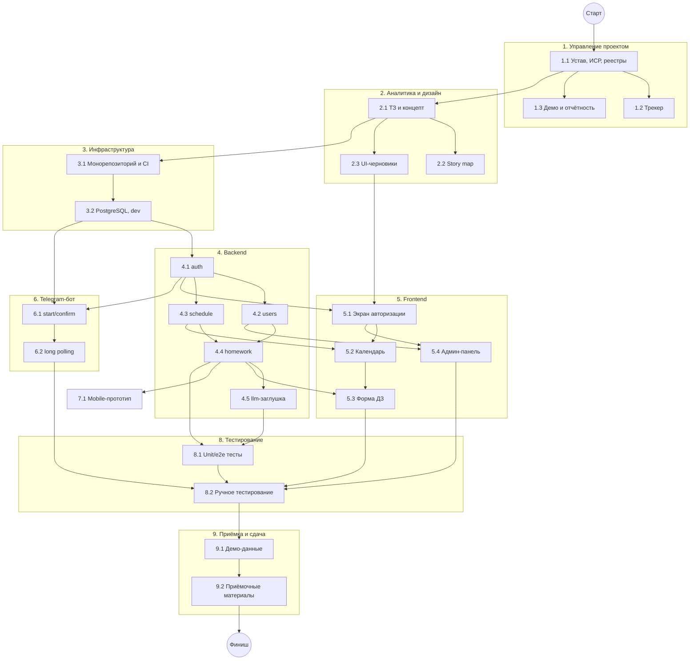

# Сетевой график и PERT-анализ

**Проект:** Zeta — система учёта домашних заданий студентов ФКН
**Фаза:** 3 (Базовый план, п. 1–2 Задания)
**Дата:** 10/06/2026
**Версия:** 1.0
**Основано на:** ИСР (`05-иерархическая-структура-работ.md`), Устав (`03-устав-проекта.md`)

---

## 1. Методология оценивания

### 1.1 Метод оценки

Оценки получены **методом трёхточечных экспертных оценок (PERT)** в соответствии с Заданием §3 п. 15.b и Кутузов §2.12.

**Процедура:**

1. Каждый член команды (5 человек) независимо оценил каждый пакет работ ИСР в часах: O (оптимистично), M (наиболее вероятно), P (пессимистично).
2. Расхождения обсуждались на общем созвоне.
3. Итоговые значения — консенсус команды с учётом аргументов.
4. Для пакетов с известным опытом (настройка CI/CD, развёртывание БД) использовалась **оценка по аналогу** с поправкой на контекст (учебный проект, free-tier хостинг).
5. **Дополнительный буфер не закладывался** — риски учитываются отдельно в реестре рисков (Фаза 3 п. 4).

### 1.2 Формулы PERT

**Ожидаемое время (оценка длительности):**

```
TE = (O + 4M + P) / 6
```

**Дисперсия:**

```
σ² = ((P - O) / 6)²
```

**Стандартное отклонение проекта (по критическому пути):**

```
σ_project = √(Σ σ² работ на критическом пути)
```

**Z-оценка (вероятность завершения в срок):**

```
Z = (T_дедлайн - TE_крит) / σ_project
```

Где:
- O (Optimistic) — оптимистичная оценка
- M (Most likely) — наиболее вероятная оценка
- P (Pessimistic) — пессимистичная оценка
- TE (Expected Time) — ожидаемое время
- σ² (Variance) — дисперсия
- T_дедлайн — доступное время до дедлайна
- TE_крит — ожидаемая длительность критического пути

**Источники формул:** Кутузов А.С. §2.12 «Примерная таблица оценки длительности операций» (формула `(О + 4В + П) / 6`); PMBOK Guide 5th ed., Chapter 6 «Project Time Management» (дисперсия, Z-оценка).

---

## 2. Сводная таблица оценок пакетов работ

| ID | Пакет работ | O | M | P | TE | σ² | Предшественники |
|:---|:---|:---:|:---:|:---:|:---:|:---:|:---|
| 1.1 | Устав, ИСР, реестры | 8 | 12 | 20 | 12.67 | 4.00 | — |
| 1.2 | Ведение трекера | 4 | 6 | 10 | 6.33 | 1.00 | 1.1 |
| 1.3 | Демо и отчётность по итерациям | 6 | 10 | 16 | 10.33 | 2.78 | 1.1 |
| 2.1 | ТЗ и концепт продукта | 8 | 12 | 20 | 12.67 | 4.00 | 1.1 |
| 2.2 | Story map и бэклог продукта | 10 | 16 | 28 | 17.00 | 9.00 | 2.1 |
| 2.3 | UI-черновики | 8 | 12 | 20 | 12.67 | 4.00 | 2.1 |
| 3.1 | Монорепозиторий и CI | 4 | 6 | 10 | 6.33 | 1.00 | 2.1 |
| 3.2 | PostgreSQL, dev-окружение, бот | 6 | 10 | 16 | 10.33 | 2.78 | 3.1 |
| 4.1 | Backend: auth | 12 | 18 | 30 | 19.00 | 9.00 | 3.2 |
| 4.2 | Backend: users | 16 | 24 | 40 | 25.33 | 16.00 | 4.1 |
| 4.3 | Backend: schedule | 20 | 30 | 50 | 31.67 | 25.00 | 4.1 |
| 4.4 | Backend: homework | 24 | 36 | 60 | 38.00 | 36.00 | 4.2, 4.3 |
| 4.5 | Backend: llm-заглушка | 4 | 6 | 10 | 6.33 | 1.00 | 4.4 |
| 5.1 | Frontend: экран авторизации | 8 | 12 | 20 | 12.67 | 4.00 | 4.1, 2.3 |
| 5.2 | Frontend: календарь/канбан | 20 | 30 | 50 | 31.67 | 25.00 | 4.3, 5.1 |
| 5.3 | Frontend: форма ДЗ | 12 | 18 | 30 | 19.00 | 9.00 | 4.4, 5.2 |
| 5.4 | Frontend: админ-панель | 10 | 16 | 28 | 17.00 | 9.00 | 4.2, 5.1 |
| 6.1 | Telegram-бот: start/confirm | 6 | 10 | 16 | 10.33 | 2.78 | 4.1, 3.2 |
| 6.2 | Telegram-бот: long polling | 8 | 12 | 20 | 12.67 | 4.00 | 6.1 |
| 7.1 | Mobile: прототип структуры | 2 | 4 | 8 | 4.33 | 1.00 | 4.4 |
| 8.1 | Unit/e2e-тесты backend | 16 | 24 | 40 | 25.33 | 16.00 | 4.4, 4.5 |
| 8.2 | Ручное тестирование MVP | 8 | 12 | 20 | 12.67 | 4.00 | 5.3, 5.4, 6.2, 8.1 |
| 9.1 | Демо-данные | 4 | 6 | 10 | 6.33 | 1.00 | 8.2 |
| 9.2 | Приёмочные материалы | 6 | 10 | 16 | 10.33 | 2.78 | 9.1 |

**Итого по проекту:**

- Суммарная плановая трудоёмкость (ΣTE): **371.00 чел.-часов**
- Количество пакетов работ: **24**

> Эта же таблица оценок трудоёмкости вынесена в отдельный артефакт — [`06-сводная-таблица-оценок.md`](06-сводная-таблица-оценок.md). Здесь она приведена как исходные данные для сетевого расчёта.

---

## 3. Расчёт PERT: ранние и поздние сроки

### 3.1 Прямой проход (ES, EF)

Правило: `ES = max(EF предшественников)`, `EF = ES + TE`.

| ID | TE | ES | EF |
|:---|:---:|:---:|:---:|
| 1.1 | 12.67 | 0.00 | 12.67 |
| 1.2 | 6.33 | 12.67 | 19.00 |
| 1.3 | 10.33 | 12.67 | 23.00 |
| 2.1 | 12.67 | 12.67 | 25.33 |
| 2.2 | 17.00 | 25.33 | 42.33 |
| 2.3 | 12.67 | 25.33 | 38.00 |
| 3.1 | 6.33 | 25.33 | 31.67 |
| 3.2 | 10.33 | 31.67 | 42.00 |
| 4.1 | 19.00 | 42.00 | 61.00 |
| 4.2 | 25.33 | 61.00 | 86.33 |
| 4.3 | 31.67 | 61.00 | 92.67 |
| 4.4 | 38.00 | 92.67 | 130.67 |
| 4.5 | 6.33 | 130.67 | 137.00 |
| 5.1 | 12.67 | 61.00 | 73.67 |
| 5.2 | 31.67 | 92.67 | 124.33 |
| 5.3 | 19.00 | 130.67 | 149.67 |
| 5.4 | 17.00 | 86.33 | 103.33 |
| 6.1 | 10.33 | 61.00 | 71.33 |
| 6.2 | 12.67 | 71.33 | 84.00 |
| 7.1 | 4.33 | 130.67 | 135.00 |
| 8.1 | 25.33 | 137.00 | 162.33 |
| 8.2 | 12.67 | 162.33 | 175.00 |
| 9.1 | 6.33 | 175.00 | 181.33 |
| 9.2 | 10.33 | 181.33 | 191.67 |

### 3.2 Обратный проход (LS, LF, резервы)

Правило: `LF = min(LS последователей)`, `LS = LF - TE`.
LF последнего пакета = EF = 191.67 ч.

| ID | TE | LS | LF | TF (полный) | FF (свободный) |
|:---|:---:|:---:|:---:|:---:|:---:|
| 1.1 | 12.67 | 0.00 | 12.67 | **0.00** | 0.00 |
| 1.2 | 6.33 | 185.33 | 191.67 | 172.67 | 172.67 |
| 1.3 | 10.33 | 181.33 | 191.67 | 168.67 | 168.67 |
| 2.1 | 12.67 | 12.67 | 25.33 | **0.00** | 0.00 |
| 2.2 | 17.00 | 174.67 | 191.67 | 149.33 | 149.33 |
| 2.3 | 12.67 | 86.33 | 99.00 | 61.00 | 23.00 |
| 3.1 | 6.33 | 25.33 | 31.67 | **0.00** | 0.00 |
| 3.2 | 10.33 | 31.67 | 42.00 | **0.00** | 0.00 |
| 4.1 | 19.00 | 42.00 | 61.00 | **0.00** | 0.00 |
| 4.2 | 25.33 | 67.33 | 92.67 | 6.33 | 0.00 |
| 4.3 | 31.67 | 61.00 | 92.67 | **0.00** | 0.00 |
| 4.4 | 38.00 | 92.67 | 130.67 | **0.00** | 0.00 |
| 4.5 | 6.33 | 130.67 | 137.00 | **0.00** | 0.00 |
| 5.1 | 12.67 | 99.00 | 111.67 | 38.00 | 12.67 |
| 5.2 | 31.67 | 111.67 | 143.33 | 19.00 | 6.33 |
| 5.3 | 19.00 | 143.33 | 162.33 | 12.67 | 12.67 |
| 5.4 | 17.00 | 145.33 | 162.33 | 59.00 | 59.00 |
| 6.1 | 10.33 | 139.33 | 149.67 | 78.33 | 0.00 |
| 6.2 | 12.67 | 149.67 | 162.33 | 78.33 | 78.33 |
| 7.1 | 4.33 | 187.33 | 191.67 | 56.67 | 56.67 |
| 8.1 | 25.33 | 137.00 | 162.33 | **0.00** | 0.00 |
| 8.2 | 12.67 | 162.33 | 175.00 | **0.00** | 0.00 |
| 9.1 | 6.33 | 175.00 | 181.33 | **0.00** | 0.00 |
| 9.2 | 10.33 | 181.33 | 191.67 | **0.00** | 0.00 |

**Обозначения:**

- ES (Early Start) — раннее начало
- EF (Early Finish) — раннее окончание
- LS (Late Start) — позднее начало
- LF (Late Finish) — позднее окончание
- TF (Total Float) — полный резерв (LS - ES)
- FF (Free Float) — свободный резерв

---

## 4. Сетевой график



**Легенда:** красным выделены пакеты на критическом пути (TF = 0).

### 4.1 Дерево зависимостей

Тот же сетевой график в компактной вертикальной раскладке: по группам ИСР, без значений TE.



---

## 5. Критический путь

### 5.1 Перечень работ на критическом пути

Критический путь — последовательность работ с нулевым полным резервом (TF = 0).

| № | ID | Пакет работ | TE (ч) |
|:---|:---|:---|:---:|
| 1 | 1.1 | Устав, ИСР, реестры | 12.67 |
| 2 | 2.1 | ТЗ и концепт продукта | 12.67 |
| 3 | 3.1 | Монорепозиторий и CI | 6.33 |
| 4 | 3.2 | PostgreSQL, dev-окружение, бот | 10.33 |
| 5 | 4.1 | Backend: auth | 19.00 |
| 6 | 4.3 | Backend: schedule | 31.67 |
| 7 | 4.4 | Backend: homework | 38.00 |
| 8 | 4.5 | Backend: llm-заглушка | 6.33 |
| 9 | 8.1 | Unit/e2e-тесты backend | 25.33 |
| 10 | 8.2 | Ручное тестирование MVP | 12.67 |
| 11 | 9.1 | Демо-данные | 6.33 |
| 12 | 9.2 | Приёмочные материалы | 10.33 |

**Длительность критического пути: 191.67 чел.-часов**

### 5.2 Визуализация критического пути

```
1.1 → 2.1 → 3.1 → 3.2 → 4.1 → 4.3 → 4.4 → 4.5 → 8.1 → 8.2 → 9.1 → 9.2
12.7   12.7   6.3   10.3   19.0   31.7   38.0   6.3   25.3   12.7   6.3   10.3
                                                              Σ = 191.67 ч
```

### 5.3 Анализ критического пути

Критический путь проходит через **ядро backend-разработки** (auth → schedule → homework → llm) и **тестирование**. Это логично: реализация предметной логики — самый трудоёмкий и неопределённый участок.

**Работы с наибольшими резервами** (можно откладывать без влияния на срок):

| ID | Пакет работ | TF (ч) |
|:---|:---|:---:|
| 1.2 | Ведение трекера | 172.67 |
| 1.3 | Демо и отчётность | 168.67 |
| 2.2 | Story map и бэклог | 149.33 |
| 6.1 | Telegram-бот: start/confirm | 78.33 |
| 6.2 | Telegram-бот: long polling | 78.33 |
| 2.3 | UI-черновики | 61.00 |

**Вывод:** управленческие и аналитические работы можно выполнять параллельно с основной разработкой, не задерживая критический путь.

---

## 6. Анализ вероятности завершения в срок

### 6.1 Дисперсия критического пути

```
σ²_крит = Σ(σ² работ на критическом пути)
        = 4.00 + 4.00 + 1.00 + 2.78 + 9.00 + 25.00
          + 36.00 + 1.00 + 16.00 + 4.00 + 1.00 + 2.78
        = 106.56
```

**Стандартное отклонение проекта:**

```
σ_project = √106.56 = 10.32 часа
```

### 6.2 Доступный фонд времени команды

Канонический календарь (устав, §3.1): **12.10.2026 — 31.12.2026**.

- Команда: **5 человек**
- Номинальный фонд (устав, §3.2): **3 часа/неделю на человека** → **15 чел.-часов/неделю** на команду
- Длительность окна: 12.10.2026 — 31.12.2026 = 81 день ≈ **11.57 недели**
- **Номинальный доступный фонд: 15 × 11.57 ≈ 174 чел.-часа**

### 6.3 Сравнение плана и ресурсов

| Параметр | Значение |
|:---|:---|
| Суммарная плановая трудоёмкость (ΣTE) | 371.00 чел.-ч |
| Длительность критического пути | 191.67 чел.-ч |
| Номинальный фонд команды (3 ч/нед) | **174 чел.-ч** |
| **Дефицит против номинального фонда** | **197.00 чел.-ч (53%)** |

Ключевое наблюдение: **номинальный фонд 3 ч/нед — это заниженная средняя величина**. Расписание (`08-расписание-гант.md`) раскладывает те же работы в рабочих днях: каждый исполнитель в период своего активного пакета работает над ним ~4 ч в рабочий день (≈20 ч/нед), а не 3 ч/нед. Именно при такой фактической загрузке в активные периоды критический путь и укладывается в срок.

### 6.4 Z-оценка и вероятность завершения в срок

Расписание Ганта на этом же календаре завершает последнюю работу (9.2 Приёмочные материалы) **23.12.2026**, при дедлайне **31.12.2026**.

```
Целевое завершение по расписанию: 23.12.2026
Дедлайн:                          31.12.2026
Резерв до дедлайна ≈ 6 рабочих дней ≈ 24 чел.-ч на критическом пути
σ критического пути = 10.32 ч
Z = 24 / 10.32 = +2.33
P(завершить к 31.12.2026) ≈ 99%
```

**Условие** этой оценки — фактическая загрузка исполнителей критических задач в активные периоды на уровне ~20 ч/нед (как заложено в расписании), а не номинальных 3 ч/нед. При жёстком соблюдении лимита 3 ч/нед средней загрузки суммарная трудоёмкость (371.00 ч) не покрывается (дефицит 53%), и вероятность падает до ~5–15%.

### 6.5 Итоговая оценка

**При плановом расписании (12.10 → 23.12, дедлайн 31.12) вероятность завершения в срок ≈ 99%** — при условии, что команда обеспечивает фактическую загрузку в активные периоды выше номинального фонда 3 ч/нед. Номинальный фонд 3 ч/нед как средняя величина недостаточен и должен быть либо повышен (формально, в уставе), либо компенсирован урезанием скоупа.

---

## 7. Сравнение с ресурсами команды

### 7.1 Сводный анализ

| Показатель | План | Номинальный фонд (3 ч/нед) | Отклонение |
|:---|:---:|:---:|:---:|
| Суммарная трудоёмкость | 371.00 ч | 174 ч | +113% |
| Длительность (крит. путь) | 191.67 ч | 174 ч | +10% |
| Календарный срок (расписание) | до 23.12.2026 | дедлайн 31.12.2026 | резерв 8 дней |

### 7.2 Нагрузка по группам ИСР

| Группа ИСР | ΣTE (ч) | Доля |
|:---|:---:|:---:|
| 1. Управление проектом | 29.33 | 7.9% |
| 2. Аналитика и дизайн | 42.33 | 11.4% |
| 3. Инфраструктура | 16.67 | 4.5% |
| 4. Backend | 120.33 | 32.4% |
| 5. Frontend | 80.33 | 21.7% |
| 6. Telegram-бот | 23.00 | 6.2% |
| 7. Mobile | 4.33 | 1.2% |
| 8. Тестирование | 38.00 | 10.2% |
| 9. Приёмка и сдача | 16.67 | 4.5% |
| **ИТОГО** | **371.00** | 100% |

**Backend (32%) и Frontend (22%)** вместе занимают более **половины** всех трудозатрат. Это зона основного риска.

---

## 8. Выводы и рекомендации

### 8.1 Ключевые выводы

1. **Критический путь** проходит через backend-разработку и тестирование (191.67 ч, 12 пакетов работ).
2. При сроке до **31.12.2026** расписание (`08-расписание-гант.md`) укладывает все работы с завершением **23.12.2026** и резервом ~8 дней — **проект реализуем** при фактической загрузке в активные периоды ~20 ч/нед на исполнителя.
3. **Номинальный фонд 3 ч/нед (средняя величина) недостаточен**: ΣTE 371.00 ч против 174 ч номинального фонда (дефицит 53%). Расхождение покрывается более высокой фактической загрузкой в периоды активных пакетов.
4. Наибольшие резервы имеют управленческие и аналитические работы — их можно выполнять параллельно, не задерживая критический путь.
5. Зона основного риска — Backend (32%) и Frontend (22%): более половины трудозатрат.

### 8.2 Рекомендации

1. **Зафиксировать фактическую загрузку.** Номинальные 3 ч/нед в уставе — средний минимум; в активные периоды пакетов загрузка исполнителя поднимается до ~20 ч/нед. Отразить это в уставе/журнале изменений, чтобы план и ресурсы не противоречили.
2. **Контролировать критический путь** (auth → schedule → homework → тестирование): любая задержка здесь напрямую двигает дату 23.12 и съедает резерв до 31.12.
3. **Держать буфер 07.12–31.12** под баг-фиксы и приёмку; при срабатывании рисков (реестр рисков `09`) — в первую очередь резать некритические пакеты с большим резервом (7.1, 5.4, 4.5).

### 8.3 Рекомендуемое решение

1. Принять расписание по `08-расписание-гант.md` (завершение 23.12.2026, дедлайн 31.12.2026).
2. Внести в устав уточнение о фактической загрузке в активные периоды (сверх номинальных 3 ч/нед).
3. На старте Этапа 2 завести журнал изменений и пересчитывать PERT при каждом существенном отклонении velocity.

---

## 9. Источники

1. Задание по предмету «Управление проектами», Фаза 3 п. 1–2.
2. Кутузов А.С. и др. Шаблоны документов для управления проектами. — М.: БИНОМ, 2014. — §2.12 (Таблица оценки длительности операций).
3. PMBOK Guide 5th edition, Chapter 6 (Project Time Management).
4. ИСР проекта Zeta (`05-иерархическая-структура-работ.md`).
5. Устав проекта Zeta (`03-устав-проекта.md`, фонд времени 3 ч/нед на человека).
6. Сводная таблица оценок (`06-сводная-таблица-оценок.md`).
7. Расписание и диаграмма Ганта (`08-расписание-гант.md`).

---

## 10. Согласование

| Должность | ФИО | Подпись | Дата |
|:---|:---|:---|:---|
| Руководитель проекта | Иван Климов | | 10/06/2026 |
| Представитель команды | | | 10/06/2026 |
| Куратор проекта | | | 10/06/2026 |
