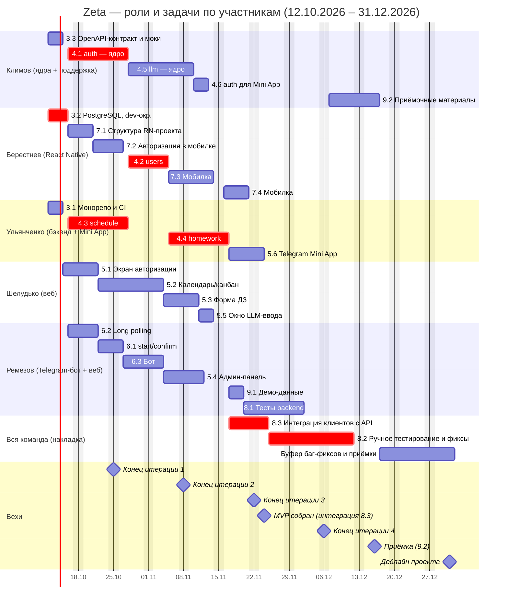

# Расписание проекта и диаграмма Ганта

**Фаза:** 3
**Проект:** Zeta — система учёта домашних заданий студентов ФКН
**Результат:** сетевой график, натянутый на рабочий календарь; все участники работают параллельно с первого дня; вехи — календарные концы двухнедельных итераций; роли каждого участника на таймлайне

## 1. Метод и допущения

**Метод.** Пакеты работ и связи взяты из ИСР ([05-иерархическая-структура-работ.md](05-иерархическая-структура-работ.md)), трудоёмкость — из сводной таблицы оценок ([06-сводная-таблица-оценок.md](06-сводная-таблица-оценок.md)), логика зависимостей — из сетевого графика ([07-Сетевой-график-и-PERT.md](07-Сетевой-график-и-PERT.md)). Расписание получено прямым проходом по зависимостям с учётом занятости исполнителей (один исполнитель — одна задача в день).

**Принцип параллельности (contract-first).** Клиенты (веб, Telegram-бот, мобильное приложение, Mini App) и backend разрабатываются **независимо и одновременно**, как только готов API-контракт. Тимлид в первые 3 дня выпускает OpenAPI-контракт и моки API (пакет 3.3); клиенты работают против моков и не ждут backend. Соединение в один контур — отдельный пакет 8.3 (интеграционная сборка).

**Рабочий календарь:**

- 5 дней в неделю (Пн–Пт), выходные — Сб, Вс.
- Часовой пояс — MSK (UTC+3).
- Праздники РФ в периоде планирования не учитываются (новогодние выходные приходятся на период после 31.12).

**Календарь проекта (канонический, см. устав §3.1):**

- **Старт:** 12.10.2026 (понедельник).
- **Дедлайн проекта:** 31.12.2026.
- **Итерации (по 2 недели):** 1 — 12.10–25.10; 2 — 26.10–08.11; 3 — 09.11–22.11; 4 — 23.11–06.12; стабилизация и приёмка — 07.12–31.12.

**Роль итераций:**

| Итерации | Режим |
|---|---|
| 1–2 (12.10–08.11) | **Разработка:** все пять участников параллельно, каждый в своей зоне; клиенты — против моков |
| 3 (09.11–22.11) | **Доработка и соединение:** `homework` готов (16.11), закрываются хвосты клиентов, стартует интеграция (8.3) |
| 4 + стабилизация (23.11–31.12) | **Накладка:** ручное тестирование, интеграционные баги, доделки и приёмочные материалы идут одновременно |

**Объём MVP (зафиксировано):** MVP — это пять **рабочих** клиентов/слоёв:

- рабочий backend (`auth`, `users`, `schedule`, `homework`, `llm`);
- рабочий веб (авторизация, календарь/канбан, форма ДЗ, админ-панель, окно LLM-ввода);
- рабочий Telegram-бот (вход, занесение ДЗ свободным текстом с подтверждением, ответы на вопросы);
- рабочее мобильное приложение на React Native (вход, просмотр расписания и ДЗ, создание/редактирование ДЗ старостой);
- рабочий Telegram Mini App (вход по `initData`, просмотр расписания и ДЗ, переключение подгруппы; создание ДЗ — только в вебе и мобильном приложении);
- **LLM — настоящая**, не заглушка: провайдер GigaChat (Сбер) или модели через OpenRouter, бесплатные тарифы.

В MVP **не входят**: push-напоминания, комментарии/статусы, роль преподавателя, интеграции с внешними календарями, управление заместителем старосты.

**Допущения по загрузке:**

- Номинальный фонд времени — **3 ч/нед на человека** (устав §3.2): ≈ 35 ч на человека и ≈ 174 ч на команду за период 12.10–31.12. Это среднее по всему периоду: вне активных пакетов исполнитель занят учёбой, на пакетах загрузка выше.
- Один исполнитель выполняет одну задачу одновременно; длительности в рабочих днях соответствуют трудоёмкости TE из `06` при средней загрузке исполнителя на задаче около 2,5–5 ч в рабочий день.
- В первые три дня (12–14.10) все участники подключены к ревью контракта API (3.3) и подготовке окружения; свои пакеты веб, мобильное приложение и бот стартуют 15–16.10.

## 2. Команда и роли

| # | Участник | Роль | Зона (ИСР) |
|---|---|---|---|
| 1 | Иван Климов | тимлид, **архитектор ядер**, Fullstack | 3.3, 4.1, 4.5, 4.6, 9.2 + сквозная поддержка всех зон |
| 2 | Берестнев Алексей | React Native / бэкенд | 3.2, 4.2, 7.1, 7.2, 7.3, 7.4 |
| 3 | Ульянченко Даниил | бэкенд / Mini App | 3.1, 4.3, 4.4, 5.6 |
| 4 | Шелудько Данил | веб (Next.js) | 5.1, 5.2, 5.3, 5.5 |
| 5 | Ремезов Никита | Telegram-бот + веб | 6.1, 6.2, 6.3, 5.4, 8.1, 9.1 |

### 2.1 Роль Климова: ядра + сквозная поддержка

Принцип распределения: **Климов берёт самое сложное и системообразующее — «ядра»**, остальное («мясо»: CRUD, экраны, сценарии, тесты по шаблону) отдаётся остальным разработчикам.

| Тип работы | Что именно |
|---|---|
| Ядра (собственные пакеты) | 3.3 **OpenAPI-контракт и моки API** (то, от чего зависят все клиенты); 4.1 `auth` (deep-link + JWT + инвайты — безопасность, контракт токенов для web/bot/mobile); 4.5 `llm` (адаптер провайдеров GigaChat/OpenRouter, промпты, ограничение контекста группой отправителя, антиспам-валидация, поведение при недоступности LLM); 4.6 вход Mini App (проверка подписи `initData`, тот же токенный контракт) |
| Приёмка | 9.2 приёмочные материалы |
| Сквозная поддержка (не в таблице задач) | Ревью PR во всех зонах; парное программирование на критических задачах (4.4 `homework`, 8.3 интеграция); разблокировка интеграций (контракты API, токены, форматы); бюджет — не более 20% рабочего дня вне собственных пакетов |

Окна Климова между собственными пакетами (13–16.11, 27.11–06.12) — резерв под поддержку команды и разбор блокеров.

## 3. Задачи с датами (сетевой график на рабочем календаре)

Порядок соответствует ИСР. Формат дат: ДД.ММ.ГГГГ. Заголовки итераций — по дате старта задачи. Пакеты групп 1 (управление) и 2 (аналитика) выполняются в рамках Этапа 1 до старта итерации 1 и в таблицу реализации не входят.

| ID | Задача | Длит., дн | Начало | Конец | Исполнитель | Предш. | Крит. |
|---|---|---|---|---|---|---|---|
| **Итерация 1 — 12.10.2026 – 25.10.2026** ||||||||
| 3.1 | Монорепозиторий и CI | 3 | 12.10.2026 | 14.10.2026 | Ульянченко | — | — |
| 3.2 | PostgreSQL, dev-окружение, бот в BotFather | 4 | 12.10.2026 | 15.10.2026 | Берестнев | — | ✅ |
| 3.3 | OpenAPI-контракт и моки API | 3 | 12.10.2026 | 14.10.2026 | Климов | — | — |
| 5.1 | Экран авторизации (веб) | 5 | 15.10.2026 | 21.10.2026 | Шелудько | 3.1, 3.3 | — |
| 4.1 | `auth` (deep-link + JWT + инвайты) | 8 | 16.10.2026 | 27.10.2026 | Климов | 3.1, 3.2, 3.3 | ✅ |
| 4.3 | `schedule` (парсинг Excel + БД) | 8 | 16.10.2026 | 27.10.2026 | Ульянченко | 3.1, 3.2 | ✅ |
| 6.2 | Long polling инфраструктура бота | 4 | 16.10.2026 | 21.10.2026 | Ремезов | 3.2 | — |
| 7.1 | Структура RN-проекта, навигация, API-клиент | 3 | 16.10.2026 | 20.10.2026 | Берестнев | 3.2, 3.3 | — |
| 7.2 | Авторизация в мобильном приложении | 4 | 21.10.2026 | 26.10.2026 | Берестнев | 7.1 | — |
| 5.2 | Календарь/канбан (веб) | 9 | 22.10.2026 | 03.11.2026 | Шелудько | 5.1 | — |
| 6.1 | Обработка `start` / `confirm` | 3 | 22.10.2026 | 26.10.2026 | Ремезов | 6.2, 3.3 | — |
| **Итерация 2 — 26.10.2026 – 08.11.2026** ||||||||
| 6.3 | Бот: ДЗ свободным текстом, подтверждение, ответы на вопросы | 6 | 27.10.2026 | 03.11.2026 | Ремезов | 6.1, 3.3 | — |
| 4.2 | `users` (роли, профиль) | 6 | 28.10.2026 | 04.11.2026 | Берестнев | 4.1, 4.3, 7.2 | ✅ |
| 4.5 | `llm` (GigaChat/OpenRouter, парсинг ДЗ, антиспам) | 9 | 28.10.2026 | 09.11.2026 | Климов | 4.1, 3.3 | — |
| 5.3 | Форма создания/редактирования ДЗ (веб) | 5 | 04.11.2026 | 10.11.2026 | Шелудько | 5.2 | — |
| 5.4 | Админ-панель (инвайты старост) | 6 | 04.11.2026 | 11.11.2026 | Ремезов | 5.1, 3.3, 6.3 | — |
| 4.4 | `homework` (CRUD + привязка к паре) | 8 | 05.11.2026 | 16.11.2026 | Ульянченко | 4.2, 4.3 | ✅ |
| 7.3 | Мобильное приложение: расписание и ДЗ | 7 | 05.11.2026 | 13.11.2026 | Берестнев | 7.2, 4.2 | — |
| **Итерация 3 — 09.11.2026 – 22.11.2026** ||||||||
| 4.6 | `auth` для Mini App (`initData` → JWT) | 3 | 10.11.2026 | 12.11.2026 | Климов | 4.1, 4.5 | — |
| 5.5 | Окно LLM-ввода ДЗ (кнопка-звёздочка, веб) | 3 | 11.11.2026 | 13.11.2026 | Шелудько | 5.3, 3.3 | — |
| 7.4 | Мобильное приложение: создание/редактирование ДЗ | 5 | 16.11.2026 | 20.11.2026 | Берестнев | 7.3 | — |
| 5.6 | Telegram Mini App (просмотр расписания/ДЗ, подгруппа) | 5 | 17.11.2026 | 23.11.2026 | Ульянченко | 4.4, 5.2, 3.3 | — |
| 9.1 | Демо-данные (синтетика) | 3 | 17.11.2026 | 19.11.2026 | Ремезов | 4.3, 4.4, 5.4 | — |
| 8.3 | Интеграционная сборка: клиенты ↔ реальный API | 6 | 17.11.2026 | 24.11.2026 | вся команда | 4.4, 4.5, 4.6 | ✅ |
| 8.1 | Unit/e2e-тесты backend | 8 | 20.11.2026 | 01.12.2026 | Ремезов | 4.1–4.5, 9.1 | — |
| **Итерация 4 — 23.11.2026 – 06.12.2026** ||||||||
| 8.2 | Ручное тестирование MVP и баг-фиксы по зонам (накладка) | 13 | 25.11.2026 | 11.12.2026 | вся команда | 8.3 | ✅ |
| **Стабилизация и приёмка — 07.12.2026 – 31.12.2026** ||||||||
| 9.2 | Приёмочные материалы (накладка на хвост 8.2) | 8 | 07.12.2026 | 16.12.2026 | Климов | 9.1, 8.1 | — |
| — | Буфер на баг-фиксы и приёмку | 11 | 17.12.2026 | 31.12.2026 | вся команда | 8.2, 9.2 | — |

**Легенда:** «Крит.» — задача на критическом пути *расписания с учётом ресурсов*. Остальные имеют резерв и могут сдвигаться без переноса финальной даты.

**Критический путь (с учётом ресурсов):**
`3.2 → 4.1 ∥ 4.3 → 4.2 → 4.4 → 8.3 → 8.2`

Клиентские цепочки (веб, бот, мобильное приложение, Mini App) не на критическом пути: они идут против моков параллельно с backend и завершаются к 23.11. Критический путь определяет backend (`auth`/`schedule` → `users` → `homework`) и интеграция.

## 4. Разрешение ресурсных конфликтов

| # | Конфликт | Кто | Как разрешён | Влияние на срок |
|---|---|---|---|---|
| 1 | Клиенты ждали бы backend (`auth`, `homework`) | Все клиенты | Contract-first: Климов выпускает OpenAPI-контракт и моки за 3 дня (3.3); клиенты стартуют 15–16.10 против моков | Простои клиентов устранены |
| 2 | `4.3 schedule`, `4.2 users`, `4.4 homework` претендовали на одного человека | Ульянченко | `4.2 users` передан Берестневу; Ульянченко ведёт `4.3` → `4.4` → `5.6` | `4.2`→`4.4` на критическом пути |
| 3 | Мобильное приложение и `4.2 users` у одного человека | Берестнев | Порядок: 3.2 → 7.1 → 7.2 → 4.2 → 7.3 → 7.4; `4.2` встаёт в окно между 7.2 и 7.3 | Мобилка завершается 20.11, не критично |
| 4 | Бот `6.x` и админ-панель `5.4` | Ремезов | Последовательно 6.2 → 6.1 → 6.3 → 5.4 → 9.1 → 8.1 | Без влияния |
| 5 | Веб: `5.1`–`5.5` на одном человеке | Шелудько | Последовательно 5.1 → 5.2 → 5.3 → 5.5; `5.4` — Ремезову, `5.6` (Mini App) — Ульянченко | Веб завершается 13.11 |
| 6 | Ядра и тесты у Климова | Климов | `8.1` передан Ремезову; Климов — ядра + поддержка | Без влияния |
| 7 | Интеграция клиентов с реальным API | Вся команда | Отдельный пакет 8.3 сразу после готовности `homework`; хвосты клиентов (7.4, 5.6, 9.1) дорабатываются одновременно | Накладка итераций 3–4 |

**Итог:** последняя плановая задача (9.2) завершается **16.12.2026**, дедлайн проекта — **31.12.2026**, резерв — 11 рабочих дней. Основной риск расписания — `homework` (4.4) и интеграция (8.3): при их задержке резерв расходуется первым; снижение риска — парная работа Климова на 4.4 и 8.3.

## 5. Загрузка по людям

Трудоёмкость TE пакетов (из `06`), чел.-ч; доля общих пакетов 8.2 и 8.3 — по 1/5 на человека (≈ 8,3 ч):

| Участник | Пакеты | ΣTE, ч | Среднее, ч/нед (11,57 нед) |
|---|---|:---:|:---:|
| Климов | 3.3, 4.1, 4.5, 4.6, 9.2 + доли 8.2/8.3 | ≈ 88 | ≈ 7,6 |
| Берестнев | 3.2, 4.2, 7.1, 7.2, 7.3, 7.4 + доли | ≈ 109 | ≈ 9,4 |
| Ульянченко | 3.1, 4.3, 4.4, 5.6 + доли | ≈ 101 | ≈ 8,8 |
| Шелудько | 5.1, 5.2, 5.3, 5.5 + доли | ≈ 82 | ≈ 7,1 |
| Ремезов | 5.4, 6.1, 6.2, 6.3, 8.1, 9.1 + доли | ≈ 101 | ≈ 8,7 |
| **Итого** | | **≈ 481** | |

Номинальный фонд при 3 ч/нед — ≈ 35 ч на человека (≈ 174 ч на команду); плановая трудоёмкость реализации ≈ 481 ч, превышение ≈ 307 ч. Это принятое допущение ритма проекта (см. `06` §5): при загрузке не выше номинальной скоуп режется по приоритету — сначала 7.4, 5.5, 6.3, 5.4. У Климова остаётся запас под сквозную поддержку (≤ 20% дня).

## 6. Роли на таймлайне (по людям)

## 7. Вехи

| Веха | Дата | Что готово |
|---|---|---|
| Конец итерации 1 | 25.10.2026 | Контракт API и моки, CI, dev-окружение; веб (авторизация, календарь в работе), мобилка (каркас, вход), бот (long polling, `start/confirm`); `auth` и `schedule` — к 27.10 |
| Конец итерации 2 | 08.11.2026 | `auth`, `schedule`, `users`; веб (календарь, форма ДЗ), бот с LLM и админ-панель, мобилка (просмотр — в работе) — против моков; `homework` и `llm` в работе |
| Конец итерации 3 | 22.11.2026 | `homework` (16.11), `llm`, вход Mini App; все клиенты feature-complete против моков (до 23.11: мобилка 20.11, Mini App 23.11); интеграционная сборка идёт |
| MVP собран | 24.11.2026 | Интеграция клиентов с реальным API завершена: рабочие backend, веб, бот, Mini App, мобильное приложение, LLM |
| Конец итерации 4 | 06.12.2026 | Ручное тестирование и баг-фиксы идут с 25.11; тесты backend завершены 26.11 |
| Приёмка | 16.12.2026 | Ручное тестирование (до 11.12) и приёмочные материалы завершены |
| Дедлайн | 31.12.2026 | Буфер 17–31.12: 11 рабочих дней на баг-фиксы и сдачу |
