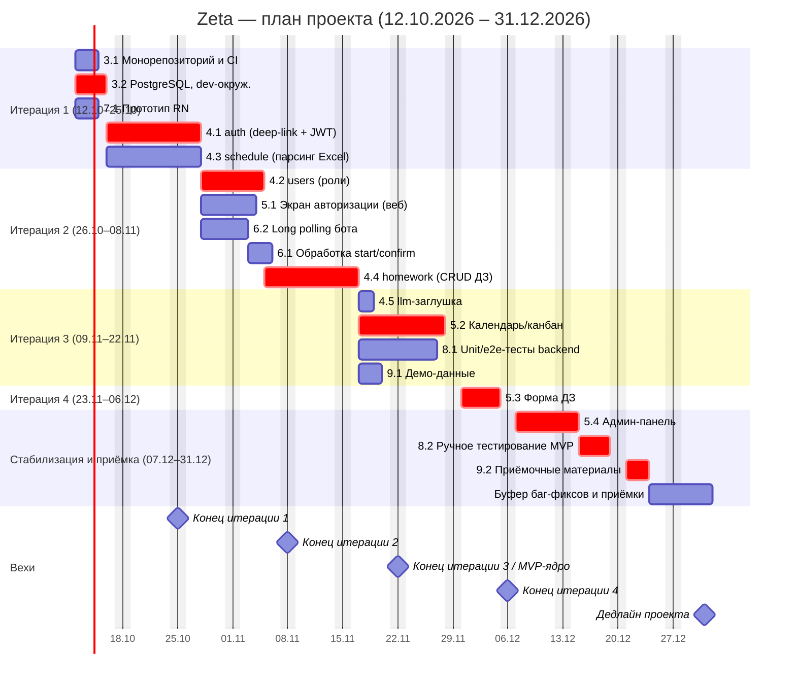

# Расписание проекта и диаграмма Ганта

**Фаза:** 3
**Проект:** Zeta — система учёта домашних заданий студентов ФКН
**Результат:** сетевой график, натянутый на рабочий календарь; разрешены ресурсные конфликты; вехи — календарные концы двухнедельных итераций

## 1. Метод и допущения

**Метод.** Пакеты работ и связи взяты из ИСР ([05-иерархическая-структура-работ.md](05-иерархическая-структура-работ.md)), трудоёмкость — из сводной таблицы оценок ([06-сводная-таблица-оценок.md](06-сводная-таблица-оценок.md)), логика зависимостей — из сетевого графика ([07-Сетевой-график-и-PERT.md](07-Сетевой-график-и-PERT.md)). Расписание получено прямым проходом по зависимостям с учётом занятости исполнителей (один исполнитель — одна задача в день).

**Рабочий календарь:**

- 5 дней в неделю (Пн–Пт), выходные — Сб, Вс.
- Часовой пояс — MSK (UTC+3).
- Праздники РФ в периоде планирования не учитываются (новогодние выходные приходятся на период после 31.12).

**Календарь проекта (канонический, см. устав §3.1):**

- **Старт:** 12.10.2026 (понедельник).
- **Дедлайн проекта:** 31.12.2026.
- **Итерации (по 2 недели):** 1 — 12.10–25.10; 2 — 26.10–08.11; 3 — 09.11–22.11; 4 — 23.11–06.12; стабилизация и приёмка — 07.12–31.12.
- **MVP:** конец итерации 3 — 22.11.2026 (ядро backend и календарь); полный состав MVP (форма ДЗ, админ-панель, ручное тестирование) завершается в период стабилизации.

**Допущения по загрузке:**

- Один исполнитель выполняет одну задачу одновременно; длительности в рабочих днях соответствуют трудоёмкости TE из `06` при средней загрузке исполнителя на задаче около 2,5–5 ч в рабочий день. Номинальный фонд 3 ч/нед (устав §3.2) — это среднее по всему периоду: вне активных пакетов исполнитель занят учёбой.
- Прототип мобильного приложения (7.1) в MVP — архитектурная закладка без функционала.

## 2. Рабочий календарь: 5 человек

| # | Участник | Роль | Зона (ИСР) |
|---|---|---|---|
| 1 | Иван Климов | тимлид, Fullstack | 3.1, 8.1, 9.2, координация |
| 2 | Берестнев Алексей | бэкенд / бот / миниапп / RN | 3.2, 4.1, 6.1, 6.2 |
| 3 | Шелудько Данил | веб (Next.js) + LLM | 5.1–5.4 |
| 4 | Ульянченко Даниил | бэкенд / миниапп | 4.2, 4.3, 4.4, 4.5 |
| 5 | Ремезов Никита | React Native | 7.1, 9.1, помощь по вебу |

## 3. Задачи с датами (сетевой график на рабочем календаре)

Порядок соответствует ИСР. Формат дат: ДД.ММ.ГГГГ. Пакеты группы 1 (управление) и 2 (аналитика) выполняются в рамках Этапа 1 до старта итерации 1 и в таблицу реализации не входят.

| ID | Задача | Длит., дн | Начало | Конец | Исполнитель | Предш. | Крит. |
|---|---|---|---|---|---|---|---|
| **Итерация 1 — 12.10.2026 – 25.10.2026** ||||||||
| 3.1 | Монорепозиторий и CI | 3 | 12.10.2026 | 14.10.2026 | Климов | — | — |
| 3.2 | PostgreSQL, dev-окружение, бот в BotFather | 4 | 12.10.2026 | 15.10.2026 | Берестнев | — | ✅ |
| 7.1 | Прототип структуры RN-проекта | 3 | 12.10.2026 | 14.10.2026 | Ремезов | — | — |
| 4.1 | `auth` (deep-link + JWT + инвайты) | 8 | 16.10.2026 | 27.10.2026 | Берестнев | 3.2 | ✅ |
| 4.3 | `schedule` (парсинг Excel + БД) | 8 | 16.10.2026 | 27.10.2026 | Ульянченко | 3.2 | — |
| **Итерация 2 — 26.10.2026 – 08.11.2026** ||||||||
| 4.2 | `users` (роли, профиль) | 6 | 28.10.2026 | 04.11.2026 | Ульянченко | 4.1 | ✅ |
| 5.1 | Экран авторизации (веб) | 5 | 28.10.2026 | 03.11.2026 | Шелудько | 4.1 | — |
| 6.2 | Long polling инфраструктура бота | 4 | 28.10.2026 | 02.11.2026 | Берестнев | 3.2 | — |
| 6.1 | Обработка `start` / `confirm` | 3 | 03.11.2026 | 05.11.2026 | Берестнев | 6.2 | — |
| 4.4 | `homework` (CRUD + привязка к паре) | 8 | 05.11.2026 | 16.11.2026 | Ульянченко | 4.3, 4.2 | ✅ |
| **Итерация 3 — 09.11.2026 – 22.11.2026** ||||||||
| 4.5 | `llm`-заглушка (интерфейс) | 2 | 17.11.2026 | 18.11.2026 | Ульянченко | 4.4 | — |
| 5.2 | Календарь/канбан (веб) | 9 | 17.11.2026 | 27.11.2026 | Шелудько | 5.1, 4.4 | ✅ |
| 8.1 | Unit/e2e-тесты backend | 8 | 17.11.2026 | 26.11.2026 | Климов | 4.1–4.4 | — |
| 9.1 | Демо-данные (синтетика) | 3 | 17.11.2026 | 19.11.2026 | Ремезов | 4.3, 4.4 | — |
| **Итерация 4 — 23.11.2026 – 06.12.2026** ||||||||
| 5.3 | Форма создания/редактирования ДЗ | 5 | 30.11.2026 | 04.12.2026 | Шелудько | 5.1, 5.2 | ✅ |
| **Стабилизация и приёмка — 07.12.2026 – 31.12.2026** ||||||||
| 5.4 | Админ-панель (инвайты старост) | 6 | 07.12.2026 | 14.12.2026 | Шелудько | 4.1, 4.2 | ✅ |
| 8.2 | Ручное тестирование MVP | 4 | 15.12.2026 | 18.12.2026 | вся команда | 5.3, 5.4, 6.1, 8.1 | ✅ |
| 9.2 | Приёмочные материалы | 3 | 21.12.2026 | 23.12.2026 | Климов | 8.2, 9.1 | ✅ |
| — | Буфер на баг-фиксы и приёмку | 6 | 24.12.2026 | 31.12.2026 | вся команда | 9.2 | — |

**Легенда:** «Крит.» — задача на критическом пути *расписания с учётом ресурсов*. Критические задачи отмечены `crit` на диаграмме; остальные имеют резерв и могут сдвигаться без переноса финальной даты.

**Критический путь (с учётом ресурсов):**
`3.2 → 4.1 → 4.2 → 4.4 → 5.2 → 5.3 → 5.4 → 8.2 → 9.2`

Он отличается от чисто логического критического пути в `07` (`…4.3 → 4.4 → 4.5 → 8.1 …`): при учёте занятости одного человека на веб-цепочке (5.2 → 5.3 → 5.4 у Шелудько) именно она определяет дату завершения. Расхождение ожидаемо — это разница между сетевым и ресурсным критическим путём.

## 4. Разрешение ресурсных конфликтов

При первичной раскладке по зависимостям несколько задач одного исполнителя пересекались. Конфликты разрешены последовательным выполнением по приоритету критического пути.

| # | Конфликт | Кто | Как разрешён | Влияние на срок |
|---|---|---|---|---|
| 1 | `4.1 auth` и `6.2 long polling` стартуют одновременно после 3.2 | Берестнев | `4.1` (критическая) идёт первой; `6.2` и `6.1` сдвинуты на 28.10–05.11 | Не критично: 6.1/6.2 имеют большой резерв |
| 2 | `4.3 schedule`, `4.2 users` и `4.4 homework` претендуют на одного человека | Ульянченко | Последовательно: `4.3` → `4.2` → `4.4` → `4.5` | `4.2`→`4.4` на критическом пути: старт `4.4` сдвинут на 05.11 |
| 3 | `5.1`, `5.2`, `5.3`, `5.4` — вся веб-цепочка на одном человеке | Шелудько | Последовательно в порядке 5.1 → 5.2 → 5.3 → 5.4; `5.2` ждёт `4.4` | Определяет финиш проекта (23.12) |
| 4 | `8.1 тесты` и координация проекта | Климов | Координация — фоновая, не более 20% дня; `8.1` стартует после готовности `4.4` | Без влияния |
| 5 | Ремезов свободен в итерациях 1–2 (после `7.1`) | Ремезов | Подключается к вебу и к `9.1 демо-данные` | Использован резерв, снижает риск веб-цепочки |

**Итог:** последняя задача (9.2) завершается **23.12.2026**, дедлайн проекта — **31.12.2026**, резерв — 6 рабочих дней (буфер на баг-фиксы и приёмку). Основной риск расписания — веб-цепочка Шелудько: при её задержке резерв расходуется первым; снижение риска — подключение Ремезова к `5.3`/`5.4`.

## 5. Диаграмма Ганта

